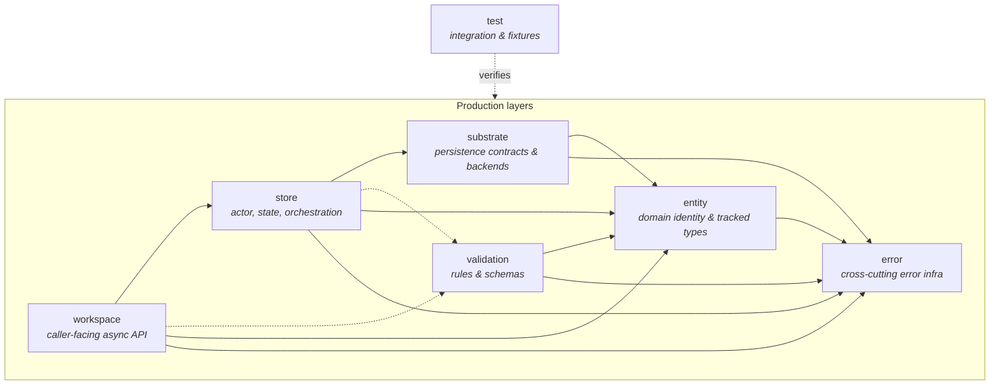
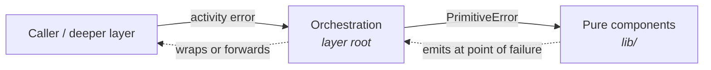

# Formal Layer Model

This document is the authoritative architectural reference for Pari's layer model. It names the layers, defines what each owns, and sets the dependency expectations between them.

The core rule: **each concept has one owning layer, layers collaborate across explicit boundaries, and no layer silently absorbs another's responsibilities.**

## Formal Layers

1. `entity`
2. `workspace`
3. `store`
4. `substrate`
5. `validation`
6. `error`
7. `test`

## Dependency Graph

**Runtime flow:** `workspace → store → substrate`. `entity` is the shared domain vocabulary; `validation` is invoked where correctness checks are needed; `error` is cross-cutting infrastructure; `test` sits outside production and may exercise any layer.

## Layer Definitions

| Layer | Owns | Does not own | May depend on |
|---|---|---|---|
| `entity` | Domain identity, entity definitions, tracked entity representations, shared value types, change-tracking primitives | Actor orchestration, persistence layout, validation policy, caller-facing flow | `error` |
| `workspace` | Caller-facing async API, operation handles, generated accessors/setters, request shaping for user intent | In-memory store state, persistence implementation, validation rule definitions | `entity`, `store`, `validation`, `error` |
| `store` | In-memory entity state, actor/message flow, checkout lifecycle, resolve/load orchestration, persist orchestration, store-owned persistence handoff types | Public caller API ergonomics, persistence layout/encoding, entity rule definitions | `entity`, `substrate`, `validation`, `error` |
| `substrate` | Persistence contracts, schema-driven asset pipeline, backend implementations, storage layout and execution | Entity Server behavior, caller-facing APIs, validation rule authorship | `entity`, `error`, and explicit store-owned persistence boundary types |
| `validation` | Validation schemas, validation rules, cross-entity validation, validation error details | Persistence, actor flow, caller transport/protocol concerns | `entity`, `error` |
| `error` | Cross-cutting error composition, classification, aggregation, umbrella error types | Domain entities, runtime orchestration, persistence, test logic | none |
| `test` | Verification strategy, fixtures, integration/end-to-end expectations, test-only support | Production runtime behavior or ownership decisions | any production layer |

## Ownership Rules

When deciding where a concept belongs:

1. If it defines what an entity is, how it is identified, or how tracked fields behave → `entity`.
2. If it defines how callers interact with entities asynchronously → `workspace`.
3. If it defines how entities are cached, checked out, resolved, loaded, merged, or persisted in memory → `store`.
4. If it defines how data is located, encoded, decoded, or written to durable storage → `substrate`.
5. If it defines what counts as valid and how invalid states are reported → `validation`.
6. If it defines how failures are classified, composed, aggregated, or emitted → `error`.
7. If it exists only to verify behavior → `test`.

When a concept touches more than one layer, the owning layer defines the behavior; other layers depend on that behavior through an explicit boundary rather than duplicating logic.

## Within-Layer Structure

Every layer follows a consistent internal split between **pure** and **orchestration** components.

### Pure components (`lib/`)

Pure components live in `lib/` subdirectories within each layer. They handle data transformation, type definitions, encoding/decoding, and rule evaluation. Every `Result`-returning function in `lib/` emits only `PrimitiveError`. Pure components have no knowledge of cross-layer concerns.

### Orchestration components (layer root)

Orchestration components live at the layer root. They coordinate across pure components and adjacent layers. At cross-layer boundaries, orchestration components emit activity errors — wrapping `PrimitiveError`s from pure components into the appropriate activity error type via `#[activity_error]`, and forwarding activity errors from deeper layers unchanged.

### Error type by component role

| Component role | Error type at boundaries |
|---|---|
| Pure (`lib/`) | `PrimitiveError` — emitted at the exact point of failure |
| Orchestration | Activity error via `#[activity_error]` — wrap or forward |

`entity` is the sole exception: it has no orchestration layer of its own and stays with `PrimitiveError` at all boundaries.

### `mod.rs` convention

`mod.rs` files contain only `mod` declarations and `pub use` re-exports — no logic, no `impl` blocks, no free functions. All logic lives in named source files.

## Component-Level Detail

L4 component docs go deeper on specific layer internals:

- [store-components.md](./store-components.md) — `EntityServer` actor + `StoreManager` state machine split, message protocol.
- [validation-model.md](./validation-model.md) — three-kind validation model, `ValidationSchema<T>`, runner flow.
- [substrate-pipeline.md](./substrate-pipeline.md) — `Substrate` trait, asset pipeline, load/persist paths.
