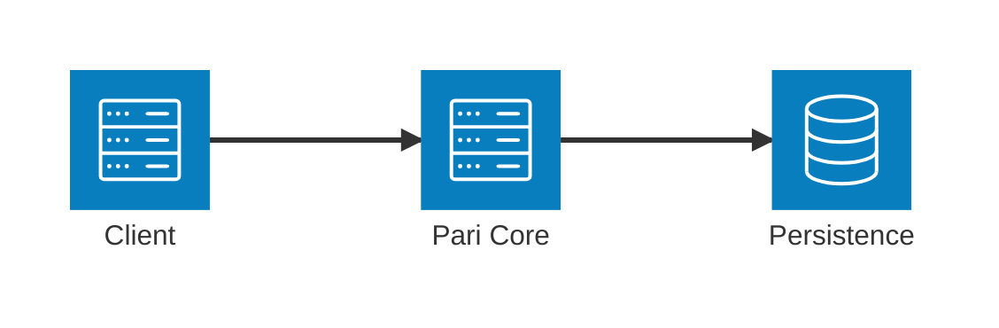
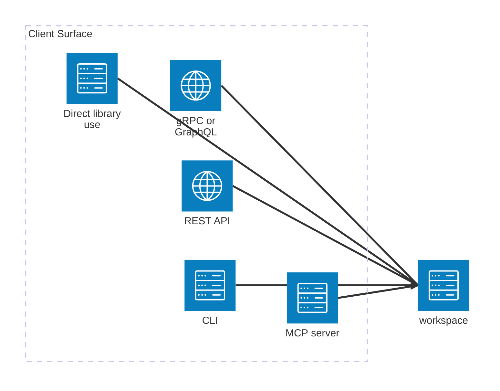
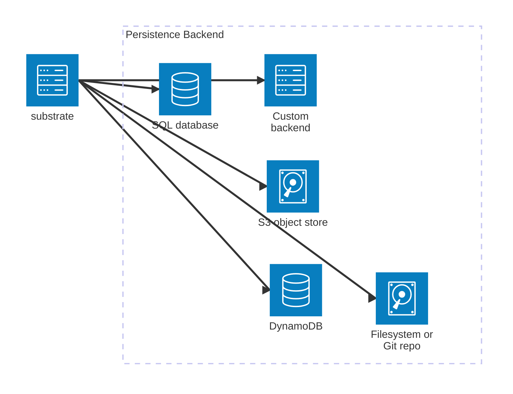
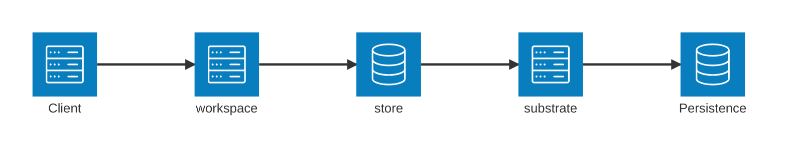
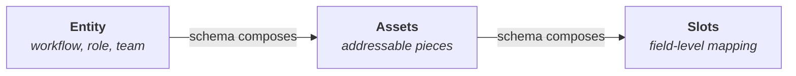
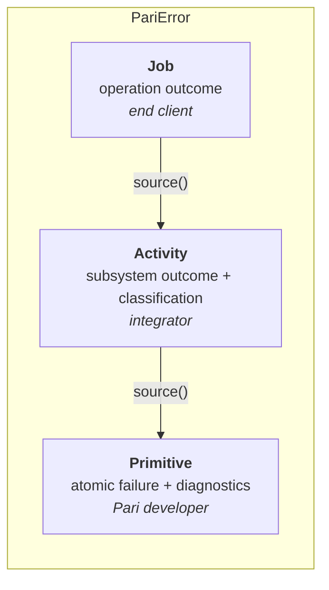

# System Architecture

A bird's-eye view of Pari as a framework. This document is the shared mental model for contributors and third-party integrators: what Pari's core provides, where integrators extend it, and how errors and observability flow through the system.

It is not a deployment diagram and does not concern itself with implementation status. It describes the architecture that guides the roadmap and the seams along which Pari is designed to grow.

## Architecture at a Glance

Three tiers: integrators bring a **Client**, Pari provides the **Core**, and data lands in **Persistence**.

Pari's core is stable. Integrators extend it along two seams:

- **Client seam** — any caller-facing surface sits on top of the `workspace` API.
- **Persistence seam** — any storage backend implements the `substrate` trait.

The core takes responsibility for the behavior between these seams: staging, caching, validation, orchestration, and a consistent error contract.

## The Two Extension Seams

Pari is designed as a framework, not a monolith. The core commits to a stable contract on both ends so integrators can bring their own components without touching core code.

### Client seam — the `workspace` API

Any caller-facing integration — an MCP server, a CLI, a REST / gRPC / GraphQL front-end, or direct embedding in another Rust application — sits on top of `workspace`. `workspace` is the single entry point to Pari's primitives. Integrators do not talk to `store`, `substrate`, or `entity` directly.

### Persistence seam — the `substrate` trait

Any storage backend — a Git repository on disk, DynamoDB, S3, a SQL database, or a bespoke store — implements the `substrate` trait. The core does not assume a specific storage shape; it drives all persistence through the contract.

Realistically, Pari cannot ship adapters for every client environment or every storage system. The seams exist so third parties can extend Pari into their environment without a fork.

## Core Layer Roles

Within the core, a request flows through `workspace`, `store`, and `substrate` on its way to persistence:

Alongside these three runtime layers, `entity` supplies the shared vocabulary — identity, tracked types, and schemas — that every core layer and every extension speaks.

Formal ownership and dependency rules live in [layer-model.md](./layers/layer-model.md); this section captures what each layer is, conceptually.

### `entity` — core definitions and schemas

The shared vocabulary that every other layer — and every extension — speaks. `entity` defines what an entity is, how entities are identified, how tracked fields behave, and the schemas that describe them. Nothing downstream has its own private notion of identity or structure; everything reduces to `entity`.

### `workspace` — uniform access gateway

The single caller-facing surface. `workspace` abstracts away the explicit loading patterns, actor plumbing, and persistence mechanics of lower layers. Callers work in terms of refs and the fields they need; data from substrate is made available transparently, without coupling callers to substrate's grammar. Validation is applied automatically on the path through `workspace` so callers do not have to orchestrate it themselves.

### `store` — staging and caching

An in-memory view that is **sparsely populated and always valid**. Granularity goes down to individual fields: `store` holds only the entities and fields the runtime has reason to hold, enabling very granular interactions without eager loading. Every piece it holds satisfies the invariants enforced at load and persist time. It owns checkout lifecycle, resolve and load orchestration, and the handoff to persistence. Upstream layers see a consistent view; downstream layers see well-framed persistence operations.

### `substrate` — persistence contract

The contract every backend implements. `substrate` defines the schema-driven asset pipeline, the encoding and decoding steps, and the storage layout semantics.

Every entity is decomposed into a fixed structure:

- **Entity** — the logical unit (a workflow, a role, a team).
- **Assets** — the addressable pieces an entity is split into. Each asset is independently locatable and loadable.
- **Slots** — the fields within an asset that a backend reads or writes. Slots are the finest-grained unit the pipeline operates on; they are what enables sparse field-level loading in `store`.

Schemas declaratively compose Slots → Assets → Entity in a uniform way, so backends do not hand-code the load/persist logic for each entity-and-asset combination. Backends decide *where* and *how* data is stored; `substrate` defines *what* a backend must be able to do. Pipeline specifics live in [substrate.md](./layers/substrate.md).

## Error Handling at a Glance

Pari surfaces a structured, hierarchical error contract. Integrators do not have to string-match on error messages to make decisions, and observability is not something every integration has to re-invent.

### Error hierarchy

Pari's error types form a hierarchy where each tier exposes a different granularity of detail and a different concern:

| Tier | Granularity | Concern exposed | Follows for |
|---|---|---|---|
| **Primitive** | Finest — the atomic failure | Exactly what broke: typed fields (path, line, id, values), `SpanTrace` + `Backtrace` captured at origin | Pari developers diagnosing the failure |
| **Activity** | Subsystem-level outcome | Which Pari component failed, corrective `hint`, and classification (`FixDomain`, `Recoverability`, `Severity`) | Integrators deciding how to react |
| **Job** | Operation-level outcome | What the client's request did, framed in their own intent | End clients receiving the result |
| **`PariError`** | Namespacing wrapper | The single umbrella type clients import — every error surfaced by Pari flows through it | All Pari consumers |

Tiers are not flattened on the way up. A `PariError` reaching a client still exposes its Job framing, and the Activity and Primitive tiers underneath remain reachable through the `source()` chain. Integrators and developers traverse to the granularity they need.

### Decision-making

Every error carries classification properties that let integrators route it without string-matching:

- **`FixDomain`** — who owns the fix: Client / Data / Infra / Pari.
- **`Recoverability`** — what to do: Retryable / UserAction / OperatorAction / NotRecoverable.
- **`Severity`** — derived from the two above.

Classification is declared at the Activity tier and propagates upward automatically. Integrators match on `recoverability()` to retry, surface to the end user, alert oncall, or escalate as a Pari bug.

### Observability integrations

Pari supports two integration paths; integrators pick based on their stack:

- **OTel** — structured events cascade down the error chain into the active span. Field names follow OTel semantic conventions. Correlation (`trace_id` / `span_id`) flows via the active tracing span, injected by the OTel subscriber — not embedded in errors. Works out-of-the-box with Datadog, Jaeger, Honeycomb, and similar backends.
- **Structured logging** — span context is extractable from the error chain for integrators using `tracing`, `slog`, or a custom logging stack.

Batch failures are surfaced as a dedicated collection type with aggregated (worst-case) classification.

### Full detail

See [error-handling.md](./layers/error-handling.md) for composition, propagation, OTel emission, and downcasting mechanics.

## Cross-References

- [layer-model.md](./layers/layer-model.md) — formal ownership, dependency rules, and within-layer structure.
- [entities.md](./layers/entities.md) — entity layer: identity, macros, tracked versions, schemas.
- [workspace.md](./layers/workspace.md) — workspace layer: uniform access gateway, transparent expansion, automatic validation.
- [store.md](./layers/store.md) — store layer: `EntityServer` + `StoreManager` split, actor model, sparse staging.
- [substrate.md](./layers/substrate.md) — substrate layer: asset pipeline, slot/asset/entity composition, schema-driven load/persist paths.
- [validation.md](./layers/validation.md) — validation layer: three-kind model, `ValidationSchema<T>`, runner flow.
- [error-handling.md](./layers/error-handling.md) — error layer: composition, propagation, OTel emission, `as_error<E>()` downcasting, SpanTrace invariants.
