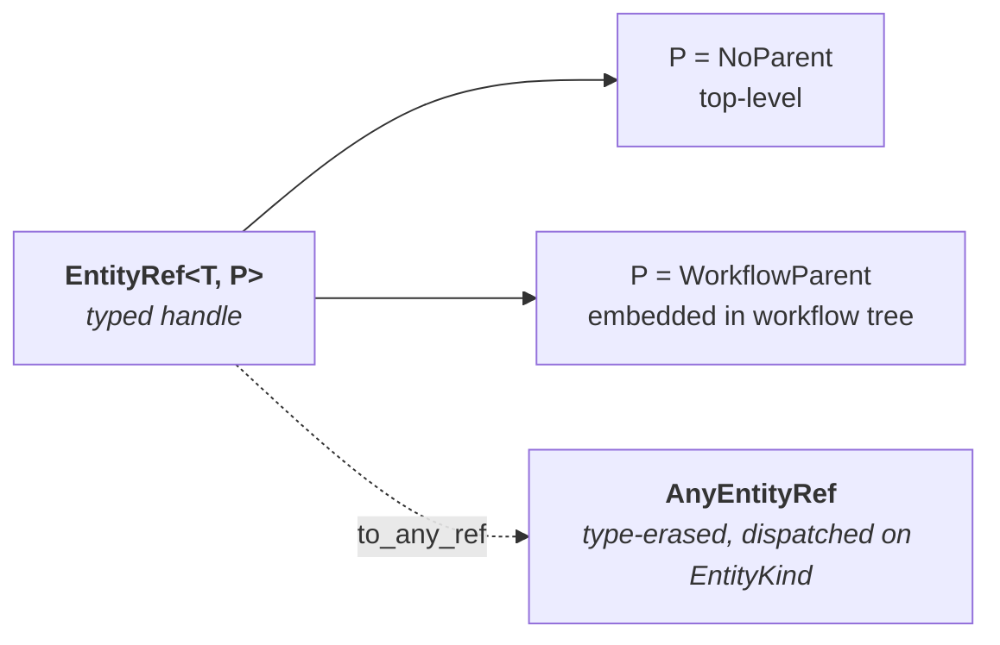
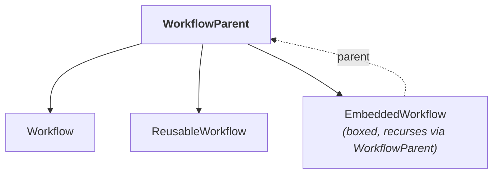
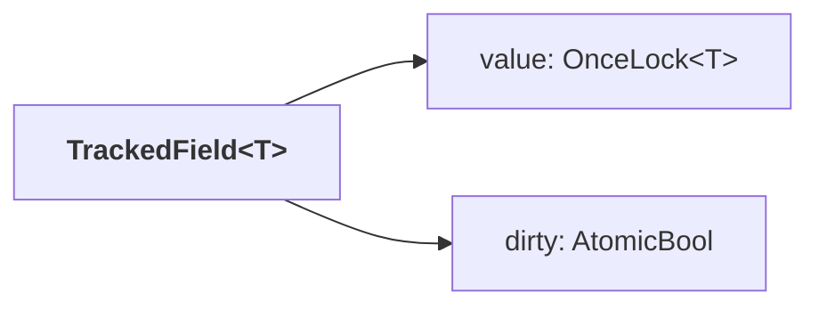

# Entities

The `entity` layer owns the domain shapes Pari operates on: identity, plain entity definitions, and the tracked-field primitive that makes per-field change tracking possible. Every other layer consumes these shapes; none of them leak back into this one.

The framework-level view is in [../framework.md](../framework.md). The layering rules are in [layer-model.md](layer-model.md). This document covers the L3 design: identity, the entity catalog, tracked fields, and the generation contract exposed by `#[derive(Entity)]`.

## Shape Of The Layer

| Goal | Consequence for the design |
|---|---|
| Identity is stable and typed | `EntityRef<T, P>` carries both entity type and parent in the type — no id-only handles. |
| Change tracking is per-field, not per-entity | Mutation produces a new `Arc<TrackedField<T>>`; untouched fields share storage. |
| Plain shapes stay plain | Domain structs have no actor, persistence, or validation machinery — a derive adds that glue. |
| Embedding is structural | The workflow tree is expressed via `ParentKind`, not id strings. |

`entity` is the sole layer that has no orchestration tier: every boundary here emits `PrimitiveError` directly ([layer-model.md](layer-model.md#layer-structure)). Generated behavior from `#[derive(Entity)]` and `entity_registry!` is consumed by `workspace`, `store`, `substrate`, and `validation` — each owns its piece of the output (see [Generation Contract](#generation-contract)).

## Entity Identity



### `EntityRef<T: Entity, P: ParentKind>`

The handle for every entity in the system. Two constructors:

| Constructor | Used for |
|---|---|
| `EntityRef::new(id)` | Top-level entities (`P = NoParent`). |
| `EntityRef::with_parent(id, parent)` | Embedded entities (`P` is a concrete parent kind). |

Hash, `Eq`, and `Debug` all incorporate `T::KIND`, so refs of different entity types with the same string id never collide. Parent is part of semantic identity: two embedded entities with the same id under different parents are distinct.

Serde shape is uniform across all refs — an object with `id` and `kind`, plus `parent` for embedded variants. The generated JSON Schema constrains the id pattern per entity kind (lowercase-kebab for top-level names, PascalCase for embedded and workflow-family ids).

### `ParentKind`

A sealed marker trait implemented only by parent shapes defined in this layer:

| Type | Role |
|---|---|
| `NoParent` | Unit type; indicates a top-level entity. Serializes as no `parent` key. |
| `WorkflowParent` | Closed enum covering every valid parent in the workflow tree. Serializes as a nested object. |

`WorkflowParent` is a real hierarchy, not a workflow-id string. Its variants recurse so that an `EmbeddedWorkflow` can itself be a parent:



### `EntityKind` and `AnyEntityRef`

`EntityKind` is a closed enum with one variant per entity type in the system. It is the runtime discriminator for every type-erased context — routing, dispatch, generated wrapper enums.

`AnyEntityRef` is the type-erased sum of all `EntityRef<T, P>` shapes, used wherever refs of mixed kinds must flow through one value (e.g., cross-entity ref collection). Each `Entity` type provides `to_any_ref(&EntityRef<Self, Self::Parent>) -> AnyEntityRef`, generated by the derive.

Both `EntityKind` and `AnyEntityRef` are generated from the single `entity_registry!` invocation in [src/entity/entity_kind.rs:15](../../../src/entity/entity_kind.rs). Adding an entity is a one-line edit there; the derive on the struct handles the rest.

### `CollectRefs`

Uniform extraction of entity refs from nested plain structures. Implemented by every plain entity, value type, and container, so callers in other layers can walk an entity and gather `(path, AnyEntityRef)` pairs without per-entity traversal code. Containers (`Option`, `Vec`, `HashMap`, `IndexMap<String, _>`) contribute their own path segments; primitive leaves (`String`, numerics, `serde_json::Value`) are no-ops.

Contract and blanket impls: [src/entity/collect_refs.rs](../../../src/entity/collect_refs.rs). Per-type impls are produced by `#[derive(CollectRefs)]`.

## Plain Entity Catalog

Nine entity types, partitioned by parent. All carry an `entity_ref`, `extensions` (flattened `x-` metadata), and common descriptive fields (`name`, `description`, `guidance` where relevant).

| Entity | Parent | Role |
|---|---|---|
| `Role` | `NoParent` | Named responsibility + traits. Referenced by RACI assignments, team members, review approvers. |
| `Hook` | `NoParent` | Instruction set + typed inputs. Invoked at lifecycle triggers via `HookCall`. |
| `Team` | `NoParent` | Roster of handles bound to roles, with `include` / `import` composition. |
| `ArtifactKind` | `NoParent` | Deliverable type — service + access guidance. Referenced by `Artifact`. |
| `Workflow` | `NoParent` | Top-level workflow: RACI, states, ordered step map, intercepts. |
| `ReusableWorkflow` | `NoParent` | Library workflow invoked via `Relay`. Same shape as `Workflow`. |
| `Task` | `WorkflowParent` | Leaf unit of work: instructions, criteria, deliverable `Artifact`, states. |
| `Relay` | `WorkflowParent` | Delegation to a `ReusableWorkflow` with a state map and optional briefing. |
| `EmbeddedWorkflow` | `WorkflowParent` | Nested workflow with recursive parent hierarchy. Same shape as `Workflow`. |

### Steps, not entities

`Step` is the enum discriminated inside a workflow's `steps: IndexMap<String, Step>` ([src/entity/entities/workflow.rs:21](../../../src/entity/entities/workflow.rs)). Variants (`Task`, `Relay`, `EmbeddedWorkflow`, `Review`) carry entity refs to the actual entities, but `Step` itself has no `EntityRef`, no derive, no identity. It is structural glue within a workflow.

### Value types

Non-entity shapes embedded in entity fields ([src/entity/types.rs](../../../src/entity/types.rs)): `Extensions`, `Raci`, `Artifact`, `HookCall`, `WorkflowStateEntry`, `TaskStateEntry`, `WorkflowSemantic`, `TaskSemantic`, `WorkflowTrigger`, `TaskTrigger`. These are plain serde structs/enums with `CollectRefs` so refs inside them (e.g., `Raci::accountable: EntityRef<Role>`) surface under their container path. They are not entities — no identity, no tracked companion.

## Tracked Fields

Every domain field on a tracked entity is `Arc<TrackedField<T>>`. The `Arc` makes checkout-time clone cheap and enables copy-on-write mutation; the inner `TrackedField<T>` carries the value and a per-field dirty flag.



### Construction paths

| Constructor | Dirty? | When it is used |
|---|---|---|
| `TrackedField::new()` | no | Empty slot; value supplied later via `initialize`. |
| `TrackedField::initialize(value)` | no | Write-once load/deserializer path. No-op if already initialized. |
| `TrackedField::loaded(value)` | no | Convenience for `From<PlainEntity>`. |
| `TrackedField::mutated(value)` | yes | Setter path. Produces the replacement `Arc` for COW swap. |

### Copy-on-write mutation

A setter does not mutate the existing `TrackedField`. It builds a new `Arc<TrackedField::mutated(v)>` and swaps the `Arc` on the tracked entity. Previous `Arc` clones held elsewhere (e.g., an in-flight checkout) see the old value unchanged. The dirty flag on the new field marks which fields the store must persist.

Primitive and related L4 detail: [src/entity/tracked/tracked_field.rs](../../../src/entity/tracked/tracked_field.rs).

## Generation Contract

Two macros produce generated behavior that spans four layers. Ownership of the generated behavior follows the layer that consumes it, not the crate that emits it.

### `#[derive(Entity)]`

Applied to every plain entity struct. Attribute form:

```rust
#[entity(kind = EntityKind::Task, parent = WorkflowParent, schema = …)]
```

| Generated item | Owning layer | Purpose |
|---|---|---|
| `Tracked<Name>` struct (fields wrapped in `Arc<TrackedField<T>>`) | `entity` | The tracked companion used throughout the runtime. |
| `impl Entity for <Name>` (with `KIND`, `Parent`, `validation_schema()`, `to_any_ref`, `extract`) | `entity` | Entity identity glue. |
| `impl TrackedFor for Tracked<Name>` | `entity` | Roundtrip: `Tracked<Name>::Entity = Name`. |
| Custom `Serialize` / `Deserialize` for the tracked companion | `entity` | Serde uses the plain shape; load path funnels through `TrackedField::initialize`. |
| Async accessors and setters on `Tracked<Name>` | `workspace` | Caller-facing per-field API. |
| Validation-schema access | `validation` | Connects the entity to its rule set. |

### `entity_registry!`

One invocation, listed in [src/entity/entity_kind.rs](../../../src/entity/entity_kind.rs), produces aggregate types and dispatch used across layers:

| Generated item | Owning layer |
|---|---|
| `EntityKind` enum | `entity` |
| `AnyEntityRef` enum + `to_any_ref` dispatch | `entity` |
| `TrackedEntity` enum (type-erased tracked wrapper) | `entity` |
| `TrackedEntity` dispatch helpers for persist/checkout | `store` |
| `TrackedEntity` substrate dispatch (load strategy, schema trait) | `substrate` |
| `TrackedEntity` validation dispatch | `validation` |

### `#[derive(CollectRefs)]`

Applied to every plain entity and value type. Produces `CollectRefs::collect_refs` walking each field, recursing through containers, and pushing any contained `EntityRef` into the accumulator with a dot-notation path.

## L4 Pointers

| Concern | Source |
|---|---|
| `EntityRef` — constructors, hash/eq, serde, JSON Schema | [src/entity/entity_ref.rs](../../../src/entity/entity_ref.rs) |
| `ParentKind`, `NoParent`, `WorkflowParent` | [src/entity/parent_kind.rs](../../../src/entity/parent_kind.rs) |
| `Entity` + `TrackedFor` traits | [src/entity/entity_trait.rs](../../../src/entity/entity_trait.rs) |
| Entity registry invocation | [src/entity/entity_kind.rs](../../../src/entity/entity_kind.rs) |
| Plain entity definitions | [src/entity/entities/](../../../src/entity/entities) |
| `Step` (not an entity) | [src/entity/entities/workflow.rs:21](../../../src/entity/entities/workflow.rs) |
| Shared value types | [src/entity/types.rs](../../../src/entity/types.rs) |
| `TrackedField<T>` | [src/entity/tracked/tracked_field.rs](../../../src/entity/tracked/tracked_field.rs) |
| `CollectRefs` trait + blanket impls | [src/entity/collect_refs.rs](../../../src/entity/collect_refs.rs) |
| `#[derive(Entity)]` generation | [pari-macros/src/entity.rs](../../../pari-macros/src/entity.rs), [entity_codegen.rs](../../../pari-macros/src/entity_codegen.rs) |
| `entity_registry!` generation | [pari-macros/src/entity_registry.rs](../../../pari-macros/src/entity_registry.rs) |
| `#[derive(CollectRefs)]` generation | [pari-macros/src/collect_refs_derive.rs](../../../pari-macros/src/collect_refs_derive.rs) |
