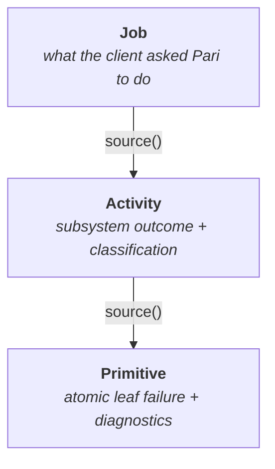
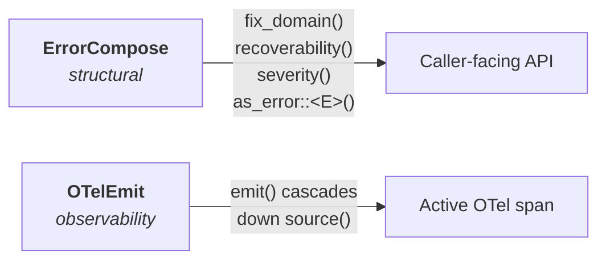

# Error Handling

The `error` layer is cross-cutting infrastructure. Every fallible operation in Pari produces an error whose shape is defined here, and every caller — integrator or internal — consumes errors through this contract.

The framework-level view is in [../framework.md](../framework.md#error-handling-at-a-glance). This document covers the L3 design: tiers, classification, composition, and emission.

## Goals

| Goal | Consequence for the design |
|---|---|
| **Actionable for callers** | Every error carries enough structure to decide *retry / surface / alert / abort* without string-matching. |
| **Diagnosable for operators** | Every error carries enough context to locate the failing component, asset, or entity without reading source. |
| **Uniform observability** | OTel emission is driven by derives, not hand-written per type. |
| **Principled composition** | Classification propagates automatically through composed chains — declared once, never re-declared. |
| **No information loss** | Structured fields from the deepest layer remain reachable at the surface via `source()` traversal and typed downcasting. |

## The Three-Tier Chain

Every error in Pari is structured as a chain of three tiers, traversable via `std::error::Error::source()`.



Every error chain is `Job → Activity → Primitive`. All three tiers are mandatory. The hierarchy speaks from a product / business perspective — it is deliberately independent of Pari's internal code structure and component hierarchy.

### Tier roles

| Tier | Owns | Audience |
|---|---|---|
| **Job** | The operation framed in client intent. Delegates classification to the Activity. | End clients |
| **Activity** | Subsystem outcome. Declares `FixDomain` + `Recoverability`. Carries `component` (which subsystem) and fixed `hint` (how to fix). | Integrators deciding how to react |
| **Primitive** | The atomic leaf failure. Carries `message`, `location`, `SpanTrace`, `Backtrace`, and typed structured fields. | Pari developers diagnosing the failure |

## Classification

Every error exposes three classification properties, declared once at the Activity tier and propagated through the chain.

### FixDomain — where the fix lives

| Value | Meaning |
|---|---|
| `Client` | Fix is in the caller's input or usage. |
| `Data` | Fix requires repairing stored content (corrupt or malformed). |
| `Infra` | Fix is in the underlying infrastructure (permissions, disk, network). |
| `Pari` | Fix is in Pari's code (invariant violated, logic bug). |

### Recoverability — what the caller should do

| Value | Meaning |
|---|---|
| `Retryable` | Transient failure — retry automatically after backoff. |
| `UserAction` | Caller must fix input or definition, then retry. |
| `OperatorAction` | Operator must fix infrastructure or data, then retry. |
| `NotRecoverable` | Invariant violated — escalate to a developer. |

### Severity — derived, never declared

Severity follows deterministically from the pair. No annotation. This prevents mismatches between declared severity and actual semantics.

| FixDomain | Recoverability | Severity |
|---|---|---|
| `Pari` | `NotRecoverable` | `Error` |
| `Data` | `OperatorAction` | `Error` |
| `Infra` | `OperatorAction` | `Error` |
| `Infra` | `Retryable` | `Warn` |
| `Client` | `UserAction` | `Warn` |

### Propagation

```
Activity →  declares: fix + recoverability
Job      →  delegates
```

Propagation is implemented by `ErrorCompose` — the Activity tier is the single source of truth for classification.

## Information Carried By Each Tier

| Dimension | Tier owning it | Mechanism |
|---|---|---|
| Debug + Display | All | `#[derive(thiserror::Error)]` |
| Cause chain | All | `#[source]` + `source()` traversal |
| `fix_domain()` / `recoverability()` / `severity()` | All (declared at Activity) | Generated by `ErrorCompose` |
| Subsystem component | Activity | `component: ActivityComponent` — fixed per variant |
| Corrective guidance | Activity | `hint: &'static str` — required, fixed per variant |
| Execution context at failure | Primitive | `SpanTrace` — captured at construction |
| Code location at failure | Primitive | `Backtrace` + `ErrorLocation` — captured at construction |
| Human-readable leaf message | Primitive | `message: String` — supplied at construction |
| Typed structured fields | Primitive | Fields declared per primitive variant |

### Explicitly not in errors

| Dimension | Where it lives instead |
|---|---|
| Correlation ID / trace ID | Active tracing span — injected by OTel subscriber into emitted records. |
| Stable error codes | The error *type name* is the stable identifier. |

## Composition and Observability Are Separate

Two derives handle two orthogonal concerns.



### `ErrorCompose` — propagation + downcasting

Handles the structural error contract. For delegating variants, propagates classification from the wrapped error. Also powers `as_error::<E>()`, which traverses the chain to recover a specific concrete error type without string-matching.

### `OTelEmit` — cascade emission

Handles observability only. A single `emit()` call at the Job tier cascades down the `source()` chain; each tier contributes its own structured fields into one OTel event at the call site.

```
PariError::emit()
  → emits job-tier fields
  → source().emit()          ← Activity tier
       → emits component, hint, activity-specific fields
       → source().emit()     ← Primitive tier
            → emits error_type, message, location,
              span_trace, backtrace, and typed detail fields
```

### Field-name conventions

All field names map to [`opentelemetry_semantic_conventions`](https://crates.io/crates/opentelemetry-semantic-conventions) where a standard field exists. No free-form naming.

| Kind of field | Convention |
|---|---|
| Exception type | OTel `exception.type` — set from the concrete type name (snake_case). |
| Exception message | OTel `exception.message` — the primitive's `message`. |
| Exception stacktrace | OTel `exception.stacktrace` — the primitive's `Backtrace`. |
| Source location | OTel `code.filepath` / `code.lineno` / `code.column` — from `ErrorLocation`. |
| Shared semantic fields | `error.component`, `error.hint` — activity-tier fields kept at stable names. |
| Tier-specific structured fields | `error.<error_type>.<snake_case_field>` — namespaced by concrete type so multiple tiers can contribute without colliding. |

## Primitive Contract

The Primitive tier is the origin of concrete diagnostic evidence. Every primitive error carries the same fixed set of common diagnostics, regardless of the specific leaf it represents.

### Fixed diagnostics

| Field | Auto-captured? | Meaning |
|---|---|---|
| `message: String` | No — supplied by caller | Human-readable explanation of the leaf failure. |
| `location: ErrorLocation` | Yes — `#[track_caller]` at the constructor | The most relevant concrete source location. Defaults to the construction site. |
| `span_trace: SpanTrace` | Yes — at construction | Tracing context captured the moment the primitive is created. |
| `backtrace: Backtrace` | Yes — at construction | Backtrace captured the moment the primitive is created. |

Capture is performed once, at the Primitive tier. Higher tiers never re-capture.

### Construction

Each primitive type is generated with two constructors:

| Constructor | Location semantics |
|---|---|
| `new(message, …fields)` | `location` is auto-captured at the call site. |
| `new_with_location(location, message, …fields)` | Caller supplies a domain-meaningful location (e.g., a document line/column, an asset path). |

Primitive authors only declare the variant's **typed detail fields** — the common diagnostics are part of the contract and are supplied by the generation machinery.

### Detail fields

Detail fields are typed per primitive variant (e.g., `path: String`, `line: usize`, `raw_snippet: String`). They surface through:

- `Display` — interpolated into the variant's error message.
- `details() -> &[PrimitiveDetail]` — structured name/value pairs for emission.
- OTel emission — under `error.<error_type>.<field_name>`.

## Example Chains

Illustrative. Actual type names are defined by the owning layer.

### Input validation

```
PariError::DefinitionRejected                           (job)
  └─ ActivityError::ValidationFailed                    (activity)
       │ component: ValidationRunner
       │ hint: "correct the field values reported..."
       │ fix: Client, recoverability: UserAction
       └─ PrimitiveError::InvalidTopLevelIdentifierFormat  (primitive)
            │ id: "my-workflow"
            │ message, location, span_trace, backtrace captured here
```

### Persist fails mid atomic swap

```
PariError::SaveFailed                                   (job)
  └─ ActivityError::CorruptPersistenceState             (activity)
       │ component: AtomicSwapExecutor
       │ fix: Infra, recoverability: OperatorAction
       └─ PrimitiveError::AssetWrite                    (primitive)
            │ asset_path: "workflows/Initiative/..."
            │ operation: "rename"
```

## Caller Usage

```rust
match err.recoverability() {
    Recoverability::Retryable      => retry_with_backoff(op),
    Recoverability::UserAction     => return Err(err.to_string()),
    Recoverability::OperatorAction => alert_oncall(&err),
    Recoverability::NotRecoverable => panic!("pari invariant: {err}"),
}

err.emit();  // structured OTel event — all tiers contribute fields

if let Some(rename_err) = err.as_error::<AssetWrite>() {
    // typed access to the primitive's fields
}
```

## L4 Pointers

Infrastructure types and their generation contracts are documented in rustdoc alongside the code:

| Concern | Source |
|---|---|
| `ErrorCompose` trait + `as_error<E>` | [`src/error/lib/compose.rs`](../../../src/error/lib/compose.rs) |
| `OTelEmit` trait | [`src/error/lib/otel_emit.rs`](../../../src/error/lib/otel_emit.rs) |
| Classification types | [`src/error/lib/fix_domain.rs`](../../../src/error/lib/fix_domain.rs), [`recoverability.rs`](../../../src/error/lib/recoverability.rs), [`severity.rs`](../../../src/error/lib/severity.rs) |
| Primitive common fields | [`src/error/lib/error_location.rs`](../../../src/error/lib/error_location.rs), [`primitive_detail.rs`](../../../src/error/lib/primitive_detail.rs), [`error_layer.rs`](../../../src/error/lib/error_layer.rs) |
| Activity enum contract | [`src/error/activity.rs`](../../../src/error/activity.rs) |
| Primitive enum contract | [`src/error/primitive/primitive_errors.rs`](../../../src/error/primitive/primitive_errors.rs) |
| Job enum | [`src/error/pari_error.rs`](../../../src/error/pari_error.rs) |
| `#[derive(ErrorCompose)]` generation | [`pari-macros/src/error_compose.rs`](../../../pari-macros/src/error_compose.rs) |
| `#[derive(OTelEmit)]` generation | [`pari-macros/src/otel_emit.rs`](../../../pari-macros/src/otel_emit.rs) |
| `primitive_errors!` generation | [`pari-macros/src/primitive_error_enum.rs`](../../../pari-macros/src/primitive_error_enum.rs) |
| `activity_errors!` generation | [`pari-macros/src/activity_error_enum.rs`](../../../pari-macros/src/activity_error_enum.rs) |
