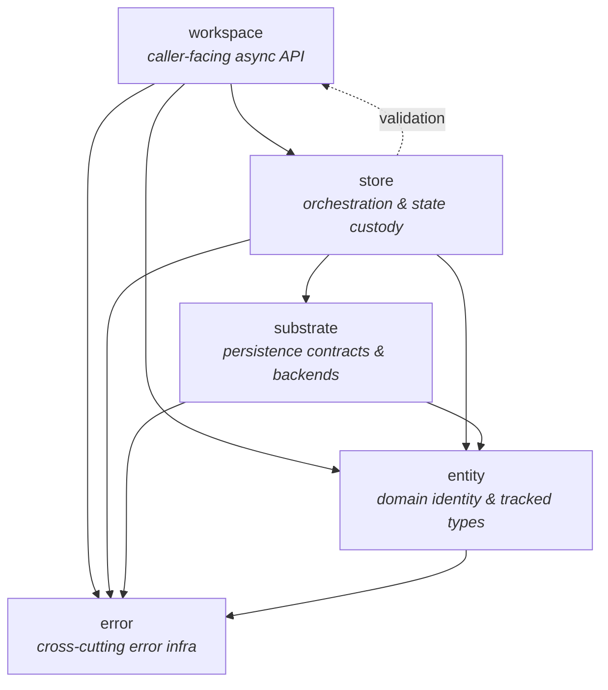
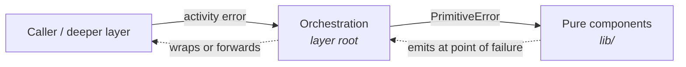

# Formal Layer Model

This document is the authoritative architectural reference for Pari's layer model. It names the layers, defines what each owns, and sets the dependency expectations between them.

The core rule: **each concept has one owning layer, layers collaborate across explicit boundaries, and no layer silently absorbs another's responsibilities.**

For the bird's-eye framework view — extension seams, conceptual roles, error hierarchy for integrators — see [framework.md](../framework.md).

## Formal Layers

1. `entity`
2. `workspace`
3. `store`
4. `substrate`
5. `error`

The next sections unfold these layers progressively: how they depend on each other, what each one owns, where new concepts go, and how every layer is internally structured.

## Dependency Graph

`workspace → store → substrate` is the runtime path: callers act through `workspace`, which orchestrates through `store`, which talks to `substrate`. `entity` is the shared domain vocabulary referenced by every other layer; `error` is cross-cutting infrastructure used everywhere.

The dotted edge from `store` back into `workspace` is the validation seam: `store` invokes validation rules through workspace-bound handles so rules can read sibling fields and resolve cross-entity refs through the same access surface callers use. This is the only cycle in the graph.

## Layer Definitions

| Layer | Owns | Does not own | May depend on |
|---|---|---|---|
| `entity` | Domain identity, entity definitions, tracked entity state, shared value types, change-tracking primitives | Caller ergonomics, persistence layout, validation policy, orchestration flow | `error` |
| `workspace` | Caller-facing async API, bounded-session handle, viewer/editor handles, generated typed accessors and setters, validation rules and schemas, validation runner | In-memory store state, persistence implementation, persistence layout | `entity`, `store`, `error` |
| `store` | In-memory entity state, orchestration of resolve/load/checkout/persist, store-side access surface to workspace, store-owned persistence handoff types | Caller-facing API ergonomics, persistence layout/encoding, validation rule definitions | `entity`, `substrate`, `workspace` (validation seam), `error` |
| `substrate` | Persistence contracts, schema-driven asset pipeline, backend implementations, storage layout and execution; speaks JSON across the wire | Store orchestration behavior, caller-facing APIs, validation rule authorship | `entity`, `error`, and explicit store-owned persistence boundary types |
| `error` | Cross-cutting error composition, classification, aggregation, umbrella error types | Domain entities, runtime orchestration, persistence | none |

## Ownership Rules

When deciding where a concept belongs:

1. If it defines what an entity is, how it is identified, or how tracked fields behave → `entity`.
2. If it defines how callers interact with entities asynchronously, what counts as a session of work, what counts as valid, or how invalid states are reported → `workspace`.
3. If it defines how entities are cached, checked out, resolved, loaded, merged, or persisted in memory → `store`.
4. If it defines how data is located, encoded, decoded, or written to durable storage → `substrate`.
5. If it defines how failures are classified, composed, aggregated, or emitted → `error`.

When a concept touches more than one layer, the owning layer defines the behavior; other layers depend on that behavior through an explicit boundary rather than duplicating logic.

## Within-Layer Structure

Every layer follows a consistent internal split between **pure** and **orchestration** components.

### Pure components (`lib/`)

Pure components live in `lib/` subdirectories within each layer. They handle data transformation, type definitions, encoding/decoding, and rule evaluation. Every `Result`-returning function in `lib/` emits only `PrimitiveError`. Pure components have no knowledge of cross-layer concerns.

### Orchestration components (layer root)

Orchestration components live at the layer root. They coordinate across pure components and adjacent layers. At cross-layer boundaries, orchestration components emit activity errors — wrapping `PrimitiveError`s from pure components into the appropriate activity error type via `#[activity_error]`, and forwarding activity errors from deeper layers unchanged.

### Error type by component role

| Component role | Error type at boundaries |
|---|---|
| Pure (`lib/`) | `PrimitiveError` — emitted at the exact point of failure |
| Orchestration | Activity error via `#[activity_error]` — wrap or forward |

`entity` is the sole exception: it has no orchestration layer of its own and stays with `PrimitiveError` at all boundaries.

### `mod.rs` convention

`mod.rs` files contain only `mod` declarations and `pub use` re-exports — no logic, no `impl` blocks, no free functions. All logic lives in named source files.

## Per-Layer Design Docs

Each layer has its own design doc covering its internals:

- [entities.md](./entities.md) — entity layer: identity, macros, tracked versions, schemas.
- [workspace.md](./workspace.md) — workspace layer: bounded session, viewer/editor handles, transparent expansion, automatic validation.
  - [validation.md](./validation.md) — validation as a workspace sub-area: three-kind model, schemas, runner flow.
- [store.md](./store.md) — store layer: staging tier, access surface, sparse field-level state.
- [substrate.md](./substrate.md) — substrate layer: asset pipeline, slot/asset/entity composition, schema-driven load/persist paths.
- [error-handling.md](./error-handling.md) — error layer: composition (`ErrorCompose`, `activity_error`), propagation, OTel emission, `as_error<E>()` downcasting, SpanTrace invariants.

See also [framework.md](../framework.md) for the framework-level view.
