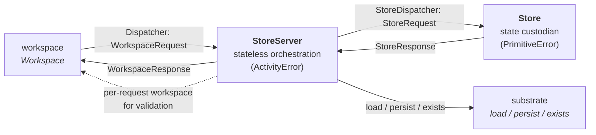
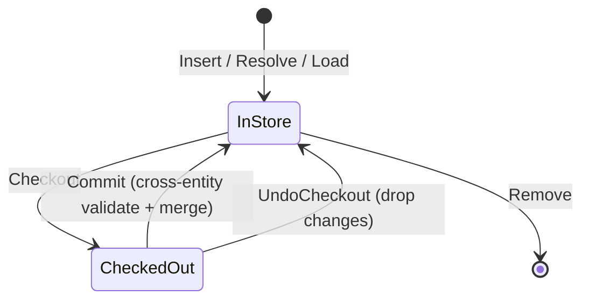
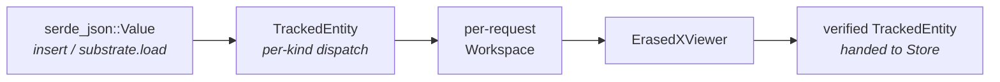
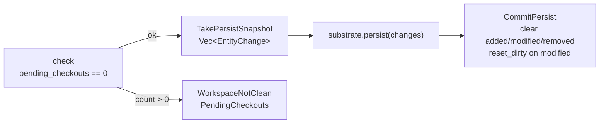

# Store

The `store` layer owns every in-memory tracked entity and every decision about when to touch the substrate. It is the only layer that holds mutable entity state: workspace dispatches caller requests into it, and substrate is invoked from inside its orchestration. Callers never see the store directly — they drive it exclusively through the `workspace` layer.

`store` is type-erased throughout. Every request, response, and internal method speaks `AnyEntityRef` and `TrackedEntity` only; no method is generic over a typed `T: Entity`. Typed↔erased conversion is a `workspace` concern.

The framework-level view is in [../framework.md](../framework.md). The layering rules are in [layer-model.md](layer-model.md). This document covers the L3 design: the two dispatch boundaries, the `StoreServer`/`Store` split, the in-memory state model, the checkout and persist lifecycles, load orchestration, the JSON ↔ tracked pipeline, and where the store decides validation runs.

## Shape Of The Layer

| Goal | Consequence for the design |
|---|---|
| Integrators wire the layer's components themselves | `Store` and `StoreServer` each return their dispatch handle from a constructor. Multiple compositions coexist; each is independent. |
| One owner of mutable state | A single `Store` per composition holds every map and set; every state mutation flows through it. |
| Orchestration is stateless | `StoreServer` is a stateless handle; concurrent callers run their orchestration in parallel, while state access is serialized inside the store. |
| Type-erased boundary with workspace | The wire types (`WorkspaceRequest`, `WorkspaceResponse`) carry only `AnyEntityRef` and `TrackedEntity`. |
| Deserialization unified at one seam | Insert and substrate-load both produce JSON; the server runs a single JSON ↔ tracked pipeline that wraps, imports, and validates before reaching the store. |
| Validation runs at well-defined moments | The store, not the caller, picks which `ValidationKind`s apply at insert, commit, and load. Validation is invoked through a per-request workspace constructed over the server's own dispatch surface. |
| Persist is all-or-nothing | Outstanding checkouts block persist; substrate is called with a snapshot, and dirty state is reset only after the substrate returns. |

`store` depends on `entity` (refs and tracked entities), `substrate` (load / persist / exists / strategy / schema), `workspace` (validation seam — invoked through `Workspace::import_erased(...).validate_with(...)`), and `error`.

## Two Dispatch Boundaries

The layer exposes two trait boundaries with parallel structure. Both live here; the workspace layer consumes the outward one.

| Trait | Direction | Carries |
|---|---|---|
| `Dispatcher` | `workspace → StoreServer` | `WorkspaceRequest` / `WorkspaceResponse` |
| `StoreDispatcher` | `StoreServer → Store` | `StoreRequest` / `StoreResponse` |



The dotted arrow is the validation seam: for operations that need validation (`insert`, `commit`, `load`), `StoreServer` constructs a per-request `Workspace` over its own `Dispatcher`, imports the type-erased entity through it, and runs the requested kinds. The trait boundary in both directions is what makes this loop sound — the server holds a weak reference to its own dispatcher so the cycle does not leak.

## Composition And Lifecycle

Each component returns its dispatch handle from its constructor:

- `Store::start(spawn_fn) -> Arc<dyn StoreDispatcher>` — creates the store's mpsc channel, constructs the `Store` value, spawns the run loop via the caller-provided `SpawnFn`, and returns the dispatcher.
- `StoreServer::start(substrate, store) -> Arc<dyn Dispatcher>` — wraps the substrate and the store-side dispatcher into a stateless server, equips it with a weak self-reference for per-request workspaces, and returns the workspace-facing dispatcher.

The integrator wires bottom-up; alternate implementations of either trait slot in at the boundary. The same composition is used in production and in tests.

```rust
let store_dispatcher  = Store::start(spawn_fn);
let server_dispatcher = StoreServer::start(substrate, store_dispatcher);
let workspace         = Workspace::new(server_dispatcher);
```

## `StoreServer` And `Store`

The split keeps long-running orchestration (substrate round-trips, validation, multi-round loads) off the critical path of state mutation.

- **`StoreServer`** — stateless. Holds an `Arc<S>` substrate, an `Arc<dyn StoreDispatcher>` to the store, and a `Weak<dyn Dispatcher>` to its own handle. Workspace dispatches `WorkspaceRequest`s into it; each caller's task drives its own orchestration sequence (validation, substrate calls, store round-trips) for that request. Multiple `Workspace` instances may dispatch through the same server concurrently.
- **`Store`** — the layer's sole state custodian and only async component. Knows nothing but its own state. Receives `StoreRequest`s, mutates its maps and sets, replies with `StoreResponse`. One message at a time, so state transitions are serialized without any locking. Emits `PrimitiveError`; the server classifies into `ActivityError` at the workspace boundary.

Cloning a `TrackedEntity` out of the store gives each orchestration task its own working snapshot; writes go back through the store.

## In-Memory State Model

`Store` holds five collections:

| Field | Type | Role |
|---|---|---|
| `entities` | `HashMap<AnyEntityRef, TrackedEntity>` | Every ref the store knows about — loaded, stubbed, or locally added. |
| `added` | `HashSet<AnyEntityRef>` | Inserted since the last persist; substrate has no copy yet. |
| `modified` | `HashSet<AnyEntityRef>` | Committed edits against an existing entity; substrate has the old version. |
| `removed` | `HashSet<AnyEntityRef>` | Evicted since the last persist; substrate still has a copy to delete. |
| `checked_out` | `HashSet<AnyEntityRef>` | Entities currently held by a caller for mutation — the single-checkout guard. |

State transitions worth naming explicitly:

- **Insert then remove before persist** — the ref comes out of `added`; it does **not** move to `removed`. Substrate has nothing to delete.
- **Remove then re-insert before persist** — the ref comes out of `removed` and lands in `modified`. Substrate has the old copy to update.
- **Commit of an `added` entity with dirty fields** — the store merges and then resets dirty on the store entity. Rationale: added entities are always written in full on persist, so per-field dirty bits serve no purpose.

## Request Dispatch

Each caller-issued `WorkspaceRequest` is handled in the caller's own task — `StoreServer::dispatch` is `&self`, so concurrent callers run their orchestration in parallel. State access is still serialized because all mutations go through the store's single channel.

| `WorkspaceRequest` | Handler |
|---|---|
| `Resolve`, `HasRef` | Return cached entity; fall through to `substrate.exists`; auto-stub on confirmed hit. |
| `Insert { json }` | JSON ↔ tracked pipeline; whole-entity validation; add to `entities` + `added`. |
| `Checkout`, `Commit`, `UndoCheckout`, `Revert` | See [Checkout Lifecycle](#checkout-lifecycle). |
| `Remove`, `Forget` | Actor-side state changes gated on checkout status. |
| `Load`, `EnsureMutable` | See [Load Orchestration](#load-orchestration). |
| `Persist` | See [Persist Orchestration](#persist-orchestration). |

`Revert` rolls an entity back to its last persisted state; `Forget` drops a clean entity's loaded fields, leaving a stub. Both are gated on the entity not being checked out.

## Checkout Lifecycle



`checked_out` is a set, not a lock table: a second `Checkout` for the same ref fails. Commit and undo-checkout are the only two ways to leave the set.

**What the store runs on commit.** Cross-entity validation only — scoped to the dirty fields when the entity was already in the store, or against the whole entity when the entity was newly added (no dirty fields means a no-op). Structural and semantic checks have already been covered: insert ran them on the whole entity at creation, and per-field setters ran them on each mutation. Commit only needs to confirm that cross-entity invariants still hold against the current store state.

**What the store runs on undo-checkout.** Nothing — the store just removes the ref from `checked_out`. The caller's local edits are dropped along with the consumed editor.

## Load Orchestration

`StoreServer::load_fields` is a recursive routine (boxed for async recursion) that pulls fields from the substrate in progressive rounds. One call per requested field may drive multiple substrate round-trips if prerequisites chain.

Conceptual algorithm:

1. **Determine pending.** Ask the store which of `fields` are not yet initialized. If none, return.
2. **Resolve prerequisites.** For each pending field, consult `substrate.load_strategy(any_ref, field)` and recurse into `load_fields(prereqs)`. Prereqs may short-circuit later rounds by populating dependent fields as a side effect.
3. **Re-check pending.** A prereq round may have initialized the target field already. Drop anything now loaded.
4. **Fetch from substrate.** Clone the current entity snapshot out of the store and call `substrate.load(&entity, &still_pending)`. The substrate decides asset layout, codec, and resolver logic; it returns a `serde_json::Value` carrying the loaded fields.
5. **Run JSON ↔ tracked pipeline.** Convert the JSON to a typed `TrackedEntity` and validate it through a per-request workspace before merge. See [JSON ↔ Tracked Pipeline](#json--tracked-pipeline). Failures wrap into `ActivityError::unpersistable_definition` — loaded data that fails validation is not merged.
6. **Merge and prefetch refs.** Initialize the store entity's fields in place (write-once). Collect cross-entity refs surfaced by the load, batch-check existence against the substrate, and auto-stub the confirmed hits.

`EnsureMutable` shares this machinery. The strategy decides how much to load: `mutable_without_load` short-circuits the field fetch, but prerequisites still run unconditionally so path resolution stays sound.

## JSON ↔ Tracked Pipeline

Two paths produce a verified `TrackedEntity` from JSON inside the server: the insert path (`WorkspaceRequest::Insert { json }`) and the substrate-load path (`substrate.load(...) -> json`). Both share the same pipeline: **JSON → TrackedEntity → import into per-request workspace → validate**. Substrate produces JSON and stops there; the workspace boundary speaks JSON for insert; the server is the conversion site.



| Site | Validated kinds | Scope |
|---|---|---|
| `Insert` | Structural + Semantic + CrossEntity | Whole entity |
| Load round | Structural + Semantic + CrossEntity | Just the loaded fields |

The per-request workspace is constructed over the server's own dispatcher (via the weak self-reference) and dropped at the end of the call. `Workspace::new` is cheap — one `Arc` clone plus a static-reference stamp for the validator.

## Persist Orchestration

Persist is an all-or-nothing flush:



The snapshot is a `Vec<EntityChange>` — the store-owned handoff type:

| Variant | Meaning |
|---|---|
| `Added(TrackedEntity)` | New entity; substrate should create. |
| `Modified(TrackedEntity, Vec<&'static str>)` | Existing entity with the listed dirty fields. |
| `Removed(AnyEntityRef)` | Substrate should delete. |

Dirty state is cleared **only after** `substrate.persist` returns successfully — a substrate error leaves the store's change lists intact for a retry. Persist itself does not validate; it trusts that prior commits and inserts were already gated.

The substrate consumes the snapshot through an `Iterator<Item = EntityChange>` rather than a callback. The pull model lets the substrate process changes at its own pace — batch-write strategies, transactional grouping, throttled fan-out — without the store having to know which strategy a backend prefers. The store materialises the full snapshot up front (a vector, not a streaming source) so a backend that fails partway never observes a half-modified store; the store's dirty state is also untouched until the substrate returns success, so retries see the same input.

## Where Store Decides Validation Runs

| Operation | Kinds run | Scope |
|---|---|---|
| `Insert` | Structural + Semantic + CrossEntity | Whole entity |
| `Commit` | CrossEntity | Whole entity if newly added; dirty fields otherwise |
| Load round (inside `load_fields` / `EnsureMutable`) | Structural + Semantic + CrossEntity | Just the loaded fields |
| `Persist` | — | Trusts prior gates |

Setter-time validation (Structural + Semantic per mutated field) runs on the workspace side and is documented in [workspace.md](workspace.md) — it is not a store decision.

The store never authors rules — it triggers them through the per-request workspace's viewer with a `ValidationKind` set chosen by the operation.

## Pure And Orchestration Components

"Pure" in the layer-model sense means the error contract, not the absence of side effects. `Store` is the layer's only async component and mutates state, but it emits only `PrimitiveError` and has no substrate or validation dependencies — so it sits in the pure tier alongside the message and change data types.

| Role | Lives in | Error type |
|---|---|---|
| Pure | `Store`, wire-message types, change-handoff enum, internal store-side request/response types | `PrimitiveError` for `Store` failures; message and change types are plain data |
| Orchestration | `StoreServer` (workspace-facing dispatcher impl, substrate calls, JSON pipeline, load/persist orchestration) | `ActivityError` — wraps store `PrimitiveError`s, forwards substrate and validation `ActivityError`s unchanged |

## Boundaries

| Concern | Owner |
|---|---|
| In-memory entity state, change tracking, checkout set, dispatch boundaries | `store` |
| Persistence layout, codecs, resolvers, load strategies, JSON encoding | `substrate` |
| Caller-facing async API, viewer/editor handles, validation rules, validation runner, setter-time validation | `workspace` |
| Cross-layer error classification and aggregation | `error` |

Store code that starts describing file layout, path resolution, or rule authoring has crossed out of this layer.
