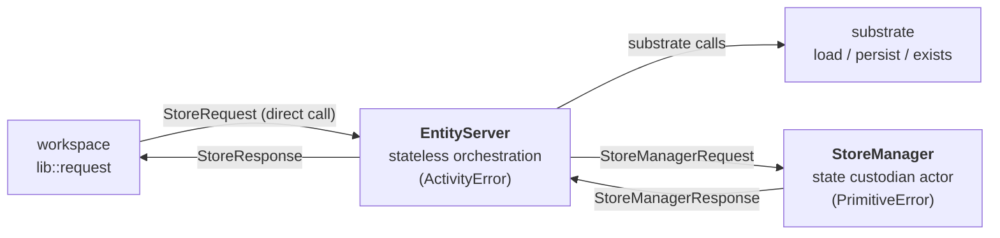
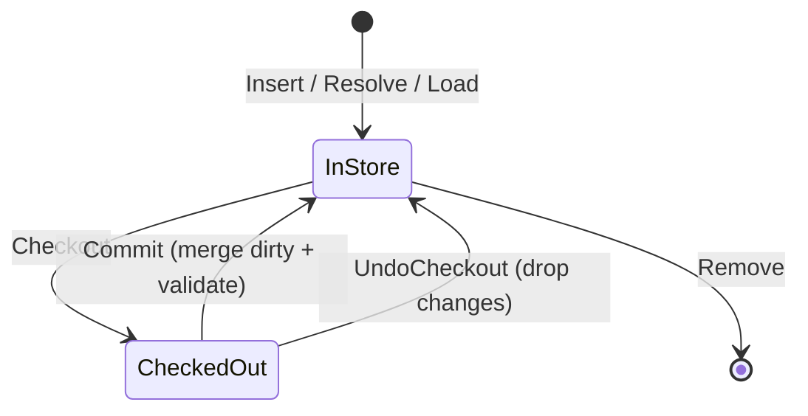
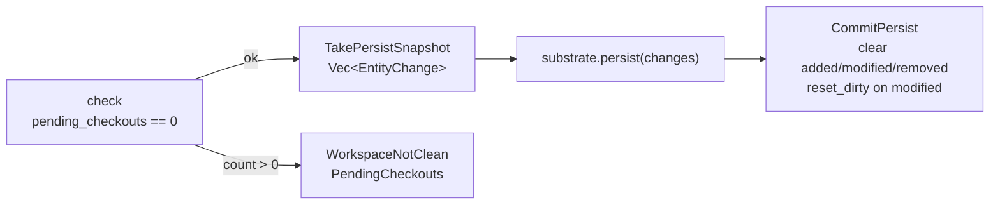

# Store

The `store` layer owns every in-memory tracked entity and every decision
about when to touch the substrate. It is the only layer that holds mutable
entity state: workspace forwards caller requests to it, and substrate is
invoked from inside its orchestration. Callers never see the store
directly — they drive it exclusively through the `workspace` layer.

The framework-level view is in [../framework.md](../framework.md). The
layering rules are in [layer-model.md](layer-model.md). This document
covers the L3 design: the `EntityServer`/`StoreManager` split, the in-memory state model, the
checkout and persist lifecycles, load orchestration, and where the store
decides validation runs.

## Shape Of The Layer

| Goal | Consequence for the design |
|---|---|
| One owner of mutable state | A single `StoreManager` actor holds every `HashMap` and `HashSet`; every mutation flows through it. |
| Orchestration is stateless | `EntityServer` is a stateless handle: workspace dispatches `StoreRequest`s into it directly, and each caller's task drives its own orchestration sequence around the manager. |
| Validation runs at well-defined moments | The store, not the caller, picks which `ValidationKind`s apply at insert, commit, load, and persist. |
| Persist is all-or-nothing | Outstanding checkouts block persist; substrate is called with a snapshot, and dirty state is reset only after the substrate returns. |

`store` depends on `entity` (for refs and tracked entities), `substrate`
(for load/persist/exists), `validation` (for rule execution), and `error`.
It does not depend on `workspace`.

## EntityServer + StoreManager

- **`EntityServer`** — stateless. Holds an `Arc<Substrate>` and a sender
  to the singleton `StoreManager`. Workspace calls it directly via the
  active entity-server handle; each caller's task drives its own
  orchestration sequence (validation, substrate calls, manager
  round-trips) for that request. Multiple `EntityServer` instances may
  coexist; they all dispatch into the same manager.
- **`StoreManager`** — the only async actor in the store. Knows nothing
  but its own state. Receives `StoreManagerRequest`s, mutates its maps
  and sets, replies. One message at a time, so state transitions are
  serialized without any locking.

The split keeps long-running orchestration (substrate round-trips,
validation) off the critical path of state mutation. Cloning a
`TrackedEntity` out of the manager gives each orchestration task its
own working snapshot; writes go back through the manager.

## In-Memory State Model

The `StoreManager` holds five collections:

| Field | Type | Role |
|---|---|---|
| `entities` | `HashMap<AnyEntityRef, TrackedEntity>` | Every ref the store knows about — loaded, stubbed, or locally added. |
| `added` | `HashSet<AnyEntityRef>` | Inserted since the last persist; substrate has no copy yet. |
| `modified` | `HashSet<AnyEntityRef>` | Committed edits against an existing entity; substrate has the old version. |
| `removed` | `HashSet<AnyEntityRef>` | Evicted since the last persist; substrate still has a copy to delete. |
| `checked_out` | `HashSet<AnyEntityRef>` | Entities currently held by a caller for mutation — the single-checkout guard. |

State transitions worth naming explicitly:

- **Insert then remove before persist** — the ref comes out of `added`; it
  does **not** move to `removed`. Substrate has nothing to delete.
- **Remove then re-insert before persist** — the ref comes out of
  `removed` and lands in `modified`. Substrate has the old copy to
  update.
- **Commit of an `added` entity with dirty fields** — the manager merges
  and then resets dirty on the store entity. Rationale: added entities
  are always written in full on persist, so per-field dirty bits serve
  no purpose.

See [src/store/manager.rs](../../../src/store/manager.rs) — the
`StoreManager` handlers `commit_checkout`, `remove_entity`, `undo_commit`
— for the authoritative transition rules.

## Request Dispatch

Each caller-issued `StoreRequest` is handled in the caller's own task —
`EntityServer::handle` is `&self`, so concurrent callers run their
orchestration in parallel. State access is still serialized because all
mutations go through the manager's single `mpsc::Receiver`.

| `StoreRequest` | Handler |
|---|---|
| `Resolve`, `HasRef` | Return cached entity; fall through to `substrate.exists`; auto-stub on confirmed hit. |
| `Insert` | Run all three validation kinds; add to `entities` + `added`. |
| `Checkout`, `Commit`, `UndoCheckout`, `UndoCommit` | See [Checkout Lifecycle](#checkout-lifecycle). |
| `Remove`, `Unload` | Manager-side state changes gated on checkout status. |
| `Load`, `EnsureMutable` | See [Load Orchestration](#load-orchestration). |
| `Persist` | See [Persist Orchestration](#persist-orchestration). |

## Checkout Lifecycle

`checked_out` is a set, not a lock table: a second `Checkout` for the
same ref fails with `PrimitiveError::already_checked_out`. Commit and
undo-checkout are the only two ways to leave the set.

**What the store runs on commit.** `EntityServer::commit` looks up whether
the ref is in `added`:

- `added` — run structural, semantic, and cross-entity validation on the
  full entity before merging.
- Existing entity with dirty fields — run cross-entity validation only,
  scoped to the dirty fields. Structural and semantic checks already ran
  at the workspace setter site against the candidate.
- No dirty fields — no-op merge.

**What the store runs on undo-checkout.** Nothing — the manager just
removes the ref from `checked_out`. The caller's local edits are dropped
along with their `TrackedEntity`.

## Load Orchestration

`EntityServer::load_fields` is a recursive routine (boxed for async
recursion) that pulls fields from the substrate in progressive rounds.
One call per requested field may drive multiple substrate round-trips if
prerequisites chain.

Conceptual algorithm:

1. **Determine pending.** Ask the manager which of `fields` are not yet
   initialized. If none, return.
2. **Resolve prerequisites.** For each pending field, consult
   `S::load_strategy(kind, field)` and recurse into
   `load_fields(prereqs)`. Prereqs may short-circuit later rounds by
   populating dependent fields as a side effect.
3. **Re-check pending.** A prereq round may have initialized the target
   field already. Drop anything now loaded.
4. **Fetch from substrate.** Clone the current entity snapshot out of
   the manager and call `substrate.load(&entity, &still_pending)`. The
   substrate decides asset layout, codec, and resolver logic; the store
   passes through what it receives.
5. **Validate before merge.** Run all three validation kinds against the
   loaded snapshot, scoped to `still_pending`. Failures wrap into
   `ActivityError::unpersistable_definition` — loaded data that fails
   validation is not merged.
6. **Merge and prefetch refs.** Initialize the store entity's fields in
   place (write-once) via `InitializeField`. Collect cross-entity refs
   surfaced by the load with `all_refs()`, batch-check existence against
   the substrate, and auto-stub the confirmed hits.

`EnsureMutable` shares this machinery. The strategy decides how much to
load: `mutable_without_load` short-circuits the field fetch, but
prerequisites still run unconditionally so path resolution stays sound.

Authoritative code: [src/store/entity_server.rs](../../../src/store/entity_server.rs)
— `load_fields` and `ensure_mutable`.

## Persist Orchestration

Persist is an all-or-nothing flush:

The snapshot is a `Vec<EntityChange>` — the store-owned handoff type
defined in [src/store/lib/change.rs](../../../src/store/lib/change.rs):

| Variant | Meaning |
|---|---|
| `Added(TrackedEntity)` | New entity; substrate should create. |
| `Modified(TrackedEntity, Vec<&'static str>)` | Existing entity with the listed dirty fields. |
| `Removed(AnyEntityRef)` | Substrate should delete. |

Dirty state is cleared **only after** `substrate.persist` returns
successfully — a substrate error leaves the store's change lists intact
for a retry.

## Where Store Decides Validation Runs

| Operation | Kinds run | Notes |
|---|---|---|
| `Insert` | Structural, Semantic, CrossEntity | All fields; entity is new to the store. |
| `Commit` of an `added` entity | Structural, Semantic, CrossEntity | Full check before the entity reaches the manager's canonical copy. |
| `Commit` of an existing entity with dirty fields | CrossEntity (scoped to dirty fields) | Structural + semantic already ran at the workspace setter. |
| `load_fields` | Structural, Semantic, CrossEntity (scoped to pending) | Load failures wrap as `unpersistable_definition`. |

The store never authors rules — it calls `validation::run_validations_for_entity`
with a `ValidationKind` set chosen by the operation.

## Test Entry Point

`pari::with(substrate, || async { ... })` is the isolated entry point
used by tests and embedded scenarios. It builds a fresh `EntityServer`
and `StoreManager`, installs the entity server as a thread-local
override for the duration of the closure, drives the manager future
internally via `futures::join!`, and tears the override down on exit —
so the call needs no runtime-specific spawner. See
[Runtime Independence](../framework.md#runtime-independence) for the
production counterpart, `pari::init`.

Authoritative code: [src/lib.rs](../../../src/lib.rs) — `pari::with` and
`pari::init`; [src/store/entity_server.rs](../../../src/store/entity_server.rs)
— `OverrideGuard` and the active-handle lookup.

## Pure And Orchestration Components

"Pure" in the layer-model sense means the error contract, not the
absence of side effects. The `StoreManager` is the layer's only async
actor and mutates state, but it emits only `PrimitiveError` and has no
substrate or validation dependencies — so it sits in the pure tier
alongside the message and change data types.

| Role | File(s) | Error type |
|---|---|---|
| Pure | [lib/message.rs](../../../src/store/lib/message.rs), [lib/change.rs](../../../src/store/lib/change.rs), [manager.rs](../../../src/store/manager.rs) | `PrimitiveError` for `StoreManager` failures; message and change enums are plain data |
| Orchestration | [entity_server.rs](../../../src/store/entity_server.rs) | `ActivityError` — wraps manager `PrimitiveError`s via `map_store_primitive`, forwards substrate and validation `ActivityError`s unchanged |

## Boundaries

| Concern | Owner |
|---|---|
| In-memory entity state, change tracking, checkout set | `store` |
| Persistence layout, codecs, resolvers, load strategies | `substrate` |
| Caller-facing async API and setter-time validation | `workspace` |
| Rule definition and execution logic | `validation` |
| Cross-layer error classification and aggregation | `error` |

Store code that starts describing file layout, path resolution, or rule
authoring has crossed out of this layer.
