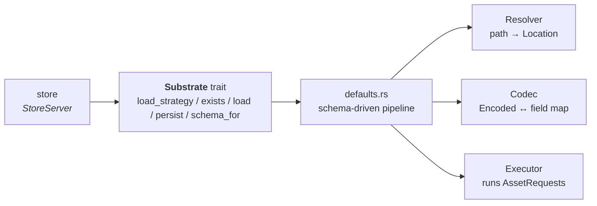
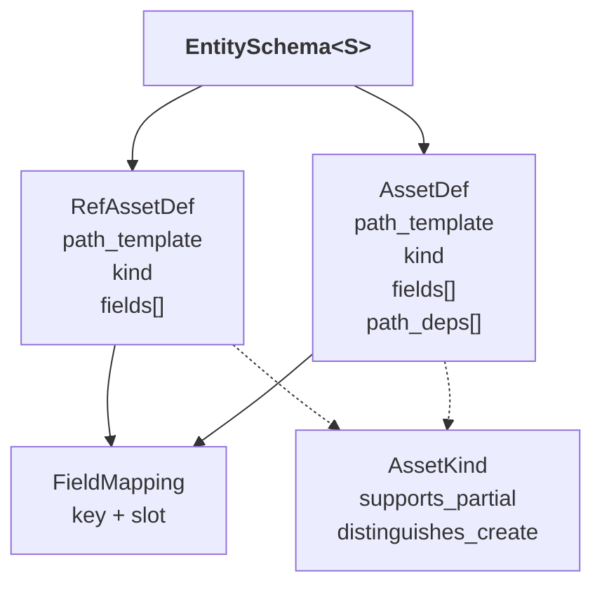

# Substrate

The `substrate` layer is where entities become bytes. It defines the
persistence contract the store calls into, a schema-backed default
pipeline that implements that contract from four reusable traits, and a
set of concrete backends built on top (`RepoSubstrate`,
`InMemorySubstrate`, `VoidSubstrate`).

Callers never touch substrate directly. The `store` layer invokes it
during `resolve`, `load`, `ensure_mutable`, `has_ref`, and `persist`.
Substrate returns `serde_json::Value` payloads or unit acknowledgements;
the store performs the JSON ↔ tracked conversion.

The framework-level view is in [../framework.md](../framework.md). The
layering rules are in [layer-model.md](layer-model.md). This document
covers the L3 design: the trait surface, the pipeline composition, the
schema model, and how the default implementations turn schema lookups
into executor requests.

## Shape Of The Layer

| Goal | Consequence for the design |
|---|---|
| One contract, many backends | A single [`Substrate`](../../../src/substrate/substrate.rs) trait declares the operations the store calls; associated types pin the backend's pipeline components. |
| Backends stay small | A schema-driven default pipeline implements `load_strategy`, `exists`, `load`, and `persist`. Backends supply a `Resolver` + `Codec` + `Executor` and opt in via `SchemaBackedSubstrate`. |
| Entity → bytes mapping is declarative | Each entity declares an [`EntitySchema`] with a `ref_asset` and zero or more `assets`. Field membership decides which asset a field load or mutation touches. |
| Partial writes are optional, correctness is not | `AssetKind::supports_partial` decides whether the executor is asked for a `Patch` or a full `Put` — but the dirty-field membership calculation is the same either way. |
| Wire boundary speaks JSON | Reads return `serde_json::Value`; writes consume the JSON projection of the entity. The trait surface never names `TrackedEntity`. |

`substrate` depends on `entity` (refs, tracked entities, `EntityKind`),
`error`, and the store-owned [`EntityChange`](../../../src/store/lib/change.rs)
handoff type. It does not depend on `workspace`, and it does not see
the store's orchestration internals — it is invoked through the
`Substrate` trait alone.

## The `Substrate` Trait



The trait surface speaks `&AnyEntityRef` for shape queries (load strategy, schema lookup) and `serde_json::Value` for entity payloads. `EntityKind` stays inside the layer as the per-kind dispatch vocabulary used by `schema_registry.rs`; it never appears in the trait's signatures.

Associated types pin the backend's pipeline:

| Associated type | Role |
|---|---|
| `Slot` | Backend-specific slot kind used in `FieldMapping` entries. `ValueSlot` is the default one-slot shape. |
| `Location` | Opaque handle the resolver produces (e.g. filesystem path). Passed to the executor. |
| `Encoded` | Opaque payload the codec produces/consumes (e.g. raw bytes). Passed to the executor. |
| `Resolver` | `LocationResolver<Location = Self::Location>` — turns a `path_template` plus entity JSON into a `Location`. |
| `Codec` | `Codec<Slot = Self::Slot, Encoded = Self::Encoded>` — encodes entity JSON for a set of `FieldMapping`s, decodes payloads back into a `field → serde_json::Value` map. |
| `Executor` | `Executor<Location = Self::Location, Encoded = Self::Encoded>` — runs a batch of `AssetRequest`s, emitting `AssetResponse`s or `PrimitiveError`s. |

A concrete backend implements `Substrate`, returns its three pipeline
components from `resolver() / codec() / executor()`, and names itself
with `substrate_name()` (used to tag components in errors). The four
data methods come for free when every entity the backend needs to
support implements `SubstrateSchema<Self>` — the
[`SchemaBackedSubstrate`](../../../src/substrate/lib/schema_registry.rs)
blanket impl dispatches per `EntityKind` to the right `EntitySchema`.

## Schema Model

Every entity declares an `EntitySchema` parameterised by the backend's
`Slot`:



- The **ref asset** is the one asset every entity has. It holds identity
  and the fields needed to resolve other assets' paths. Its
  `path_template` never depends on other fields — the ref asset is the
  only asset that can be resolved from an `AnyEntityRef` alone.
- **Assets** hold the rest of the fields. Their `path_template` may
  reference fields declared in `path_deps`; those prerequisites must be
  loaded before the asset's location can be resolved.
- Each **field** appears in exactly one asset — enforced by a lazily
  built index in `EntitySchema::lookup`, which panics on duplicate
  registrations.
- **`AssetKind`** carries two flags that drive write-op selection:
  `supports_partial` (executor accepts `Patch`) and
  `distinguishes_create` (executor distinguishes `Post` from `Put`).

The central derived value is the **load strategy** for a field:

| `LoadStrategy` field | Meaning |
|---|---|
| `prerequisites` | Fields the store must ensure are loaded before the target field's containing asset can be fetched or mutated. |
| `mutable_without_load` | `true` if the field's asset can be written without reading first — either `supports_partial` on the asset kind, or a single-field asset where a full overwrite replaces the whole asset. |

`EntitySchema::load_strategy_for(field)` is the function the store calls
(via the `Substrate::load_strategy` default).

## Default Pipeline

The four data methods default to a schema-driven implementation in
[src/substrate/defaults.rs](../../../src/substrate/defaults.rs). All
four compose the same three pipeline components:

| Method | Behavior |
|---|---|
| `load_strategy(any_ref, field)` | Schema lookup only — no executor call. Wraps `PrimitiveError` as `ActivityError::invalid_persistence_layout`. |
| `schema_for(any_ref)` | Returns the `&'static EntitySchema<Self::Slot>` for the ref's kind. Pure dispatch through `schema_registry.rs`. |
| `exists(refs)` | One `AssetOp::Head` per ref against each ref asset's resolved `Location`. Batched through the executor in one call. |
| `load(entity, fields)` | `AssetMapper::select_for_read(fields)` → resolve each asset's location from the entity's own JSON → `AssetOp::Get` batch → codec-decode each response into a `field → Value` map → return a `serde_json::Value` carrying the loaded fields, merged onto the entity's existing JSON projection. The store wraps the result into a tracked entity through its JSON ↔ tracked pipeline. |
| `persist(changes)` | For each `EntityChange`: `Removed` emits `AssetOp::Delete` for every asset (resolved from a stub JSON); `Added` emits full-asset writes; `Modified` emits partial writes when the asset covers only a subset of the dirty fields. Everything is enqueued into one executor batch. |

**Write-op selection** happens inside `AssetKind::write_op`:

| Situation | Op chosen |
|---|---|
| Partial write allowed and requested | `Patch` |
| Create flagged and the kind distinguishes create | `Post` |
| Otherwise | `Put` |

A write is flagged partial only when the asset covers more fields than
are dirty (`asset_write_is_partial` in defaults.rs). If every field in
the asset is dirty, the asset is rewritten as a full `Put` even for
modifications.

## Executor Contract

The executor is the only component that does I/O. Its contract lives in
[src/substrate/lib/pipeline/asset_io.rs](../../../src/substrate/lib/pipeline/asset_io.rs):

```rust
pub enum AssetOp<E> { Put(E), Post(E), Patch(E), Delete, Get, Head }
pub struct AssetRequest<L, E> { pub location: L, pub op: AssetOp<E> }
pub enum AssetResponse<E> { Done, Data(E), Exists(bool) }
```

`Executor::execute` takes an iterator of requests and returns either a
vector of responses aligned with the inputs, or a vector of
`PrimitiveError`s if any request failed. The defaults layer collapses a
multi-error batch into a single `ActivityError::corrupt_persistence_state`
via `collapse_executor_errors`.

## Concrete Backends

| Backend | Location | Purpose |
|---|---|---|
| `RepoSubstrate` | [src/substrate/repo/](../../../src/substrate/repo) | Filesystem-backed backend. `Location = PathBuf`, `Encoded = Vec<u8>`. Used as the production storage shape. |
| `InMemorySubstrate` | [src/substrate/in_memory/](../../../src/substrate/in_memory) | RAM-backed backend. Useful for tests that want the full schema pipeline without touching disk. |
| `VoidSubstrate` | [src/substrate/void.rs](../../../src/substrate/void.rs) | Minimal no-op backend for tests that only need the contract surface (no reads, no writes). |

Every backend picks its `Resolver`, `Codec`, and `Executor` types and
provides accessors. All three receive their schema via the shared
`SchemaBackedSubstrate` blanket impl — adding a new entity kind to the
system updates the impl once and every backend picks it up.

## Pure And Orchestration Components

"Pure" in this layer, as everywhere else, is about the error contract:
components that emit only `PrimitiveError` and never depend on the
store or validation orchestration sit in the pure tier.

| Role | File(s) | Error type |
|---|---|---|
| Pure | [lib/pipeline/](../../../src/substrate/lib/pipeline), [lib/serde.rs](../../../src/substrate/lib/serde.rs), [lib/schema_registry.rs](../../../src/substrate/lib/schema_registry.rs) | `PrimitiveError` — schema lookups, codec, executor, serde helpers |
| Orchestration | [substrate.rs](../../../src/substrate/substrate.rs), [defaults.rs](../../../src/substrate/defaults.rs), backends under [repo/](../../../src/substrate/repo), [in_memory/](../../../src/substrate/in_memory), [void.rs](../../../src/substrate/void.rs) | `ActivityError` — wraps primitives via `invalid_persistence_layout`, `unpersistable_definition`, and `corrupt_persistence_state` |

## Boundaries

| Concern | Owner |
|---|---|
| Persistence contract, schema model, default pipeline, backends | `substrate` |
| In-memory entity state, change tracking, persist/load orchestration, JSON ↔ tracked conversion | `store` |
| Caller-facing async API, viewer/editor handles, validation rules and runner | `workspace` |
| Cross-layer error classification and aggregation | `error` |

Substrate code that starts describing store dispatch, checkout rules,
or rule authoring has crossed out of this layer.
