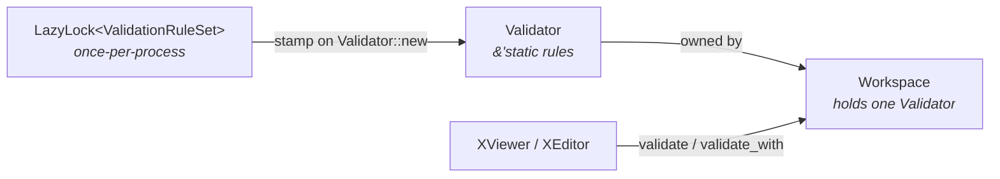
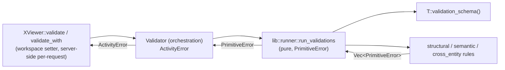

# Validation

Validation lives inside the `workspace` layer. It owns *what* is valid: a per-entity-kind schema of field-level rules, the runner that executes those rules, and the `Validator` that workspace constructs once per session. It owns nothing about *when* validation runs — that decision lives in workspace's generated setters and in `StoreServer` orchestration sites that route through a per-request workspace.

The framework-level view is in [../framework.md](../framework.md). The layering rules are in [layer-model.md](layer-model.md). This document covers the L3 design of the validation sub-area: the rule model, the schema structure, the runner, the `Validator` handle, and how callers compose `kinds` × `fields` arguments to express the intent of each trigger point.

## Shape Of The Layer

| Goal | Consequence for the design |
|---|---|
| Field-level granularity | Rules are keyed by field name. Sparse tracked entities are legal — only fields actually present (or explicitly requested) are validated. |
| Three distinct rule kinds | Structural / Semantic / CrossEntity — split by *what context* a rule needs (value only, sibling fields, store access through the workspace). Callers pick which kinds run. |
| Errors accumulate | The runner walks every requested `(field, kind)` pair and aggregates failures. No short-circuit. |
| Decision stays outside | The schema offers rules; the runner executes them. Which trigger fires which `(fields, kinds)` combination lives in workspace setters and `StoreServer`. |
| Rules read entity state through viewers | Semantic and cross-entity rules take `&XViewer<'_, T>`. Sibling-field reads and cross-entity ref resolution flow through the same handles callers use. |

The validation sub-area depends on `entity` (tracked entity state, refs, `CollectRefs`) and `error`. Cross-entity rules reach the store through the viewer's workspace; they have no separate dispatch surface.

## Rule Model

Three rule kinds, distinguished by the context they need and by whether they are async:

| Kind | Signature | Context | Failure shape |
|---|---|---|---|
| Structural | `Fn(&V) -> Vec<PrimitiveError>` (sync) | Only the field's candidate value | `PrimitiveError` |
| Semantic | `for<'a> Fn(&'a XViewer<'_, T>) -> Pin<Box<dyn Future<Output = Vec<PrimitiveError>>>>` | Entity's own state via the viewer's typed async accessors | `PrimitiveError` |
| CrossEntity | Same shape as Semantic | Entity's own state plus cross-entity refs resolved through `viewer.workspace().resolve(...)` / `has_ref(...)` | `PrimitiveError` |

All three rule signatures emit `PrimitiveError` — they are pure components of the layer. Wrapping into `ActivityError` happens once, at the orchestration boundary.

Rules are atomic: each rule validates its scope and returns a flat `Vec<PrimitiveError>`. They know nothing about which field they belong to or which kind they are — the runner owns that bookkeeping.

### Why Three Kinds?

The split is driven by what information a rule needs to produce an answer, which in turn drives *when* a caller can afford to run it:

- **Structural** rules can run on a raw candidate value with no entity context — the workspace setter runs them inline before the value is even installed.
- **Semantic** rules need the entity but not the store — the setter can run them against a transient candidate viewer, since sibling reads only touch the candidate's own fields (with transparent load through the viewer's workspace if needed).
- **CrossEntity** rules need other entities. They run only at gates that have a per-request workspace already in flight: insert, commit, load.

This mapping is the reason different triggers run different `kinds` — see the [When Validation Runs](#when-validation-runs) table.

## ValidationSchema

Each entity declares a static `ValidationSchema<E>` — three maps from field name to a list of rules for that field:

```text
ValidationSchema<E> {
    structural:    HashMap<&'static str, Vec<AnyStructuralRule<E>>>
    semantic:      HashMap<&'static str, Vec<AnySemanticRule<E>>>
    cross_entity:  HashMap<&'static str, Vec<AnyCrossEntityRule<E>>>
}
```

Absence from a map means "no rules of this kind for this field" — not an error. `all_field_names()` returns the union of keys across the three maps and is used when the runner is asked to validate "every field in the schema".

Per-entity schemas live alongside their entity type in `lib/rules/` — one file per entity kind (`role.rs`, `workflow.rs`, …). Each file defines a `*_validation_schema()` function that builds and returns the schema; these are the functions `#[derive(Entity)]`'s generated `validation_schema()` dispatches to.

## Validator

`Validator` is the workspace-side runner host. It holds a `&'static` reference to a process-wide rule registry built once on first use, and exposes the runner entry points the workspace calls into.



| Property | |
|---|---|
| Construction | `Validator::new()` stamps the static registry reference; effectively free. |
| Lifetime | Owned by `Workspace`, lives as long as the workspace does. |
| Reuse | One validator per workspace serves every validation invoked through any viewer/editor borrowed from that workspace. |
| Per-request OK | Because construction is free, `StoreServer` can build a per-request workspace (and validator) for each insert/commit/load without measurable overhead. |

The runner entry point on `Validator` takes a viewer plus the `(fields, kinds)` selection and is reachable through `XViewer::validate` / `XViewer::validate_with` (and `XEditor::*` via `Deref`). There is no public free-function form.

## Runner

Validation has the standard pure / orchestration split.



### Pure runner

The pure runner:

1. Resolves the schema via `T::validation_schema()`.
2. Decides the target field set:
   - `fields == &[]` → all fields across the three maps.
   - Otherwise → the provided slice, after a field-selection check confirms every name appears in at least one map.
3. For each target field, for each requested kind, looks up and runs the rules listed in that map. Appends each rule's `Vec<PrimitiveError>` to the field's accumulator.
4. If any field has errors, wraps them into a `PrimitiveError::FieldValidationError { field_name → Vec<PrimitiveError> }`.
5. Otherwise returns `Ok(())`.

The pure runner emits only `PrimitiveError`. Field selection that references unknown names surfaces as `PrimitiveError::InvalidValidationFieldSelection` — a separate variant so the orchestration layer can classify it differently from rule failures.

### Orchestration: `Validator` and viewer entry points

`Validator::run<T>(viewer, fields, kinds)` wraps the pure runner and is the only validation entry the rest of the crate calls — through the viewer:

| Entry point | When used |
|---|---|
| `XViewer::validate(&self)` | Whole-entity validation with the schema's default kinds — used by the per-request server-side workspace at insert and commit. |
| `XViewer::validate_with(&self, fields, kinds)` | Parameterised form for setter / load callers. `fields = &[]` means "whole entity"; otherwise restricts field-scoped rules to those. |

Both classify `PrimitiveError` into `ActivityError` with the same rule:

| `PrimitiveError` variant | `ActivityError` classification |
|---|---|
| `InvalidValidationFieldSelection` | `pari_invariant_violation` — the caller asked about a field the schema does not know. This is a programmer bug. |
| `FieldValidationError` (anything else) | `validation_failed` — legitimate field-rule failure to surface back to the caller. |

## When Validation Runs

The validation sub-area does not decide when it runs. Each trigger picks `fields` and `kinds` to match the context it has available.

| Trigger | Where | `fields` | `kinds` | Rationale |
|---|---|---|---|---|
| Setter | `XEditor::set_<field>` against a transient candidate viewer | `&[field_name]` | Structural + Semantic | Setter has no other entities in scope; runs everything that the candidate alone can decide. |
| Insert | `StoreServer.handle_insert` via per-request workspace | `&[]` (whole entity) | Structural + Semantic + CrossEntity | Entity is fully populated by construction — full gate. |
| Commit | `StoreServer.handle_commit` via per-request workspace | `&[]` if newly added; `dirty_fields()` otherwise | CrossEntity | Structural and semantic are already covered: insert ran them whole-entity at creation; setters ran them per field on each mutation. Only cross-entity may have shifted between checkout and commit. |
| Load | `StoreServer.load_fields` via per-request workspace | newly loaded fields | Structural + Semantic + CrossEntity | Fields just came from substrate; validate them before merging into the store. |

Two properties fall out of this table:

- **Setter + commit together cover the full gate.** Structural and semantic are enforced eagerly at mutation time; cross-entity runs at the authoritative boundary.
- **Load-path validation is cross-entity-aware.** Cross-entity rules run on newly loaded fields because store state (and referenced entities) may have changed since the entity was last valid.

## Cross-Entity Rules And Ref Expansion

Cross-entity rules reach the store through the viewer's workspace — no dedicated client surface. A rule body that needs to confirm a sibling exists writes:

```rust
let other = viewer.workspace().resolve(other_ref).await?;
```

The result is another `XViewer<'_, _>` bound to the same workspace, so further reads (and further cross-entity hops) use the same transparent-load pathway as application code.

The single shared primitive is `check_refs`: it takes a `Vec<(field_path, AnyEntityRef)>` and returns `PrimitiveError::ReferencedEntityAbsent` for any ref that does not exist in the store. The `ref_check_rule!` macro is the usual way a schema declares a cross-entity rule for a refs-carrying field:

```rust
cross_entity.insert("raci", vec![ref_check_rule!(TrackedWorkflow, raci)]);
```

Expansion: collect every ref the field carries via `CollectRefs::collect_refs` (synchronous, before the async boundary), then `check_refs` each pair (async, through the viewer's workspace). More elaborate cross-entity rules — hook input binding, cycle detection, embedded-tree shape — are defined per-entity in `lib/rules/cross_entity/`.

Store transport errors inside `check_refs` are deliberately silent — the store layer surfaces its own transport failures independently, and a validation rule should not pretend an absent entity is a store-connectivity problem.

## Structural Primitives

`lib/rules/structural/primitives.rs` collects the shared building blocks used across entity schemas — `kebab_case`, `pascal_case`, `pascal_case_id`, `non_empty_str`, `non_empty_list`, `min_length`, `unique_by`, `x_prefix_keys`, and entity-specific helpers like `states_valid_workflow` and `raci_structural`. Each returns `Vec<PrimitiveError>`; entity schemas combine them into field-level rules.

## Pure / Orchestration Split

| Component | Tier | Error contract |
|---|---|---|
| `lib::schema` (`ValidationSchema`, rule type aliases, field-selection check) | Pure | `PrimitiveError` |
| `lib::runner` (rule dispatch, error accumulation) | Pure | `PrimitiveError` |
| `lib::rules::*` (structural primitives, semantic rules, cross-entity rules, per-entity schemas) | Pure | `PrimitiveError` |
| `Validator` (registry stamp, viewer-driven entry, error classification) | Orchestration | `ActivityError` |

`ValidationKind` is a plain enum used by callers to describe intent — not tied to either tier.

Cross-entity rules call `viewer.workspace().has_ref`, which returns `ActivityError`. `check_refs` collapses that away: `Ok(true)` → no-op, `Ok(false)` → push a `PrimitiveError::ReferencedEntityAbsent`, `Err(_)` → silent. So rule bodies still satisfy the pure-tier contract even though their implementation briefly touches an activity error internally.
