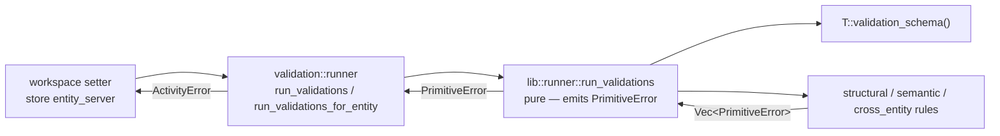

# Validation

The `validation` layer owns *what* is valid. It defines a
per-entity-kind schema of field-level rules, executes those rules over
a tracked entity, and returns accumulated failures. It owns nothing
about *when* validation runs — that decision belongs to the `store`
layer (and, for the setter fast path, to the `workspace` layer's
generated code).

The framework-level view is in [../framework.md](../framework.md). The
layering rules are in [layer-model.md](layer-model.md). This document
covers the L3 design: the rule model, the schema structure, the runner,
and how callers compose `kinds` × `fields` arguments to express the
intent of each trigger point.

## Shape Of The Layer

| Goal | Consequence for the design |
|---|---|
| Field-level granularity | Rules are keyed by field name. Sparse tracked entities are legal — only fields actually present (or explicitly requested) are validated. |
| Three distinct rule kinds | Structural / Semantic / CrossEntity — split by *what context* a rule needs (value only, sibling fields, store access). Callers pick which kinds run. |
| Errors accumulate | The runner walks every requested `(field, kind)` pair and aggregates failures. No short-circuit. |
| Decision stays outside | The schema offers rules; the runner executes them. Which trigger runs which `(fields, kinds)` combination lives in `store` and in workspace-layer generated setters. |

`validation` depends on `entity` (tracked entities, `EntityKind`,
`CollectRefs`), `error`, and — for cross-entity rules only — on
`workspace::EntityClient` to query store state via `has_ref`.

## Rule Model

Three rule kinds, distinguished by the context they need and by whether
they are async:

| Kind | Signature | Context | Failure shape |
|---|---|---|---|
| [`AnyStructuralRule<E>`](../../../src/validation/lib/schema.rs) | `Fn(&E::Tracked) -> Vec<PrimitiveError>` (sync) | Only the tracked entity's own field value | `PrimitiveError` |
| [`AnySemanticRule<E>`](../../../src/validation/lib/schema.rs) | `for<'a> Fn(&'a E::Tracked) -> Pin<Box<dyn Future<…>>>` (async) | Entity's own state; sibling fields load transparently via tracked accessors | `PrimitiveError` |
| [`AnyCrossEntityRule<E>`](../../../src/validation/lib/schema.rs) | Alias of `AnySemanticRule<E>` | Same shape, but rules may call [`EntityClient::has_ref`](../../../src/workspace/client.rs) | `PrimitiveError` |

All three rule signatures emit `PrimitiveError` — they are pure
components of the layer. Wrapping into `ActivityError` happens once, at
the edge, in [`validation::runner`](../../../src/validation/runner.rs).

Rules are atomic: each rule validates its scope and returns a flat
`Vec<PrimitiveError>`. They know nothing about which field they belong
to or which kind they are — the runner owns that bookkeeping.

### Why Three Kinds?

The split is driven by what information a rule needs to produce an
answer, which in turn drives *when* a caller can afford to run it:

- **Structural** rules can run on a raw candidate value with no entity
  context — the setter runs them before the value is even installed.
- **Semantic** rules need the entity but not the store — the setter can
  run them inline using the tracked entity's transparent-load
  accessors.
- **CrossEntity** rules need the store — they cannot run at setter
  time (setters have no store handle), so the store runs them itself
  at insert/load/commit time.

This mapping is the reason the store picks different `kinds` at each
trigger — see the [When Validation Runs](#when-validation-runs) table
below.

## ValidationSchema

Each entity declares a static
[`ValidationSchema<E>`](../../../src/validation/lib/schema.rs) — three
maps from field name to a list of rules for that field:

```text
ValidationSchema<E> {
    structural:    HashMap<&'static str, Vec<AnyStructuralRule<E>>>
    semantic:      HashMap<&'static str, Vec<AnySemanticRule<E>>>
    cross_entity:  HashMap<&'static str, Vec<AnyCrossEntityRule<E>>>
}
```

Absence from a map means "no rules of this kind for this field" — not
an error. `all_field_names()` returns the union of keys across the
three maps and is used when the runner is asked to validate "every
field in the schema".

Per-entity schemas live alongside their entity type in
[`src/validation/lib/rules/`](../../../src/validation/lib/rules/) —
one file per entity kind (`role.rs`, `workflow.rs`, …). Each file
defines a `*_validation_schema()` function that builds and returns the
schema; these are the functions `#[derive(Entity)]`'s generated
`validation_schema()` dispatches to.

Every `TrackedX` struct implements
[`ValidatableTracked<E>`](../../../src/validation/lib/schema.rs) via a
blanket impl, giving the runner a single entry point for structural
rule execution regardless of the concrete tracked type.

## Runner

Validation has the standard pure / orchestration split.



### Pure runner

[`lib::runner::run_validations<T>`](../../../src/validation/lib/runner.rs):

1. Resolve the schema via `T::validation_schema()`.
2. Decide the target field set:
   - `fields == &[]` → all fields across the three maps.
   - Otherwise → the provided slice, after
     [`validate_field_selection`](../../../src/validation/lib/schema.rs)
     confirms every name appears in at least one map.
3. For each target field, for each requested kind, look up and run the
   rules listed in that map. Append the rule's
   `Vec<PrimitiveError>` to the field's accumulator.
4. If any field has errors, wrap them into a
   `PrimitiveError::FieldValidationError { field_name → Vec<PrimitiveError> }`.
5. Otherwise return `Ok(())`.

The pure runner emits only `PrimitiveError`. Field selection that
references unknown names surfaces as
`PrimitiveError::InvalidValidationFieldSelection` — a separate
variant so the orchestration layer can classify it differently from
rule failures.

### Orchestration entry points

[`validation::runner`](../../../src/validation/runner.rs) wraps the
pure runner and is the only validation API the rest of the crate
calls:

| Entry point | When used |
|---|---|
| `run_validations::<T>(entity, fields, kinds)` | Typed call path from generated setters; entity is `&T::Tracked`. |
| `run_validations_for_entity(&TrackedEntity, fields, kinds)` | Type-erased dispatch used by `EntityServer` — forwards through the tracked wrapper enum. |

Both classify `PrimitiveError` into `ActivityError` with the same
rule:

| `PrimitiveError` variant | `ActivityError` classification |
|---|---|
| `InvalidValidationFieldSelection` | `pari_invariant_violation` — the caller asked about a field the schema does not know. This is a programmer bug, not a user-visible failure. |
| `FieldValidationError` (anything else) | `validation_failed` — legitimate field-rule failure to surface back to the caller. |

## When Validation Runs

The validation layer does not decide when it runs. Each caller picks
`fields` and `kinds` to match the context it has available. Today
there are four trigger points:

| Trigger | Location | `fields` | `kinds` | Why these |
|---|---|---|---|---|
| Setter (best-effort) | Generated in [`pari-macros::workspace_codegen`](../../../pari-macros/src/workspace_codegen.rs) | `&[field_name]` | `Structural`, `Semantic` | Setter has no store handle; runs everything that does not need one. |
| Insert (new entity via client) | [`entity_server::EntityServer::insert`](../../../src/store/entity_server.rs) | `&[]` (all fields) | `Structural`, `Semantic`, `CrossEntity` | Entity is fully populated by construction — run the full gate. |
| Load (partial fetch) | [`entity_server::EntityServer::load_fields`](../../../src/store/entity_server.rs) | newly loaded fields | `Structural`, `Semantic`, `CrossEntity` | Fields just came from substrate; validate them before merging into the store. |
| Commit checkout (added) | [`entity_server::EntityServer::commit`](../../../src/store/entity_server.rs) | `&[]` (all fields) | `Structural`, `Semantic`, `CrossEntity` | Same reasoning as insert. |
| Commit checkout (modified) | `entity_server::EntityServer::commit` | `dirty_fields()` | `CrossEntity` only | Structural + semantic already ran at setter time; store state may have changed since, so cross-entity re-runs. |

Two properties fall out of this table:

- **Setter + commit together cover the full gate.** Structural and
  semantic are enforced eagerly at mutation time; cross-entity runs
  once at the authoritative boundary.
- **Load-path validation is cross-entity-aware.** Cross-entity rules
  run on newly loaded fields because store state (and referenced
  entities) may have changed since the entity was last valid.

## Cross-Entity Rules And Ref Expansion

Cross-entity rules need store access. They get it through
[`EntityClient`](../../../src/workspace/client.rs) — the same
workspace-facing handle callers use — so they participate in the same
transparent-load pathway as application code.

The single shared primitive is
[`check_refs`](../../../src/validation/lib/rules/cross_entity/common.rs):
it takes a `Vec<(field_path, AnyEntityRef)>` and returns
`PrimitiveError::ReferencedEntityAbsent` for any ref that does not
exist in the store.

The [`ref_check_rule!`](../../../src/validation/lib/rules/cross_entity/common.rs)
macro is the usual way a schema declares a cross-entity rule for a
refs-carrying field:

```rust
cross_entity.insert("raci", vec![ref_check_rule!(TrackedWorkflow, raci)]);
```

Expansion: collect every ref the field carries via
[`CollectRefs::collect_refs`](../../../src/entity/collect_refs.rs)
(synchronous, before the async boundary), then `check_refs` each pair
(async). More elaborate cross-entity rules — hook input binding, cycle
detection, embedded-tree shape — are defined per-entity in
[`src/validation/lib/rules/cross_entity/`](../../../src/validation/lib/rules/cross_entity/).

Store transport errors inside `check_refs` are deliberately silent —
the store layer surfaces its own transport failures independently, and
a validation rule should not pretend an absent entity is a
store-connectivity problem.

## Structural Primitives

[`src/validation/lib/rules/structural/primitives.rs`](../../../src/validation/lib/rules/structural/primitives.rs)
collects the shared building blocks used across entity schemas —
`kebab_case`, `camel_case`, `camel_case_id`, `non_empty_str`,
`non_empty_list`, `min_length`, `unique_by`, `x_prefix_keys`, and
entity-specific helpers like `states_valid_workflow` and
`raci_structural`. Each returns `Vec<PrimitiveError>`; entity
schemas combine them into field-level rules.

## Pure / Orchestration Split

| Component | Tier | Error contract |
|---|---|---|
| [`lib::schema`](../../../src/validation/lib/schema.rs) (`ValidationSchema`, rule type aliases, field-selection check) | Pure | `PrimitiveError` |
| [`lib::runner`](../../../src/validation/lib/runner.rs) (rule dispatch, error accumulation) | Pure | `PrimitiveError` |
| [`lib::rules::*`](../../../src/validation/lib/rules/) (structural primitives, semantic rules, cross-entity rules, per-entity schemas) | Pure | `PrimitiveError` |
| [`runner`](../../../src/validation/runner.rs) (`run_validations`, `run_validations_for_entity`) | Orchestration | `ActivityError` |

`ValidationKind` in [`kind.rs`](../../../src/validation/kind.rs) is a
plain enum used by callers to describe intent — not tied to either
tier.

Cross-entity rules call `EntityClient::has_ref`, which returns
`ActivityError`. `check_refs` collapses that away: `Ok(true)` →
no-op, `Ok(false)` → push a `PrimitiveError::ReferencedEntityAbsent`,
`Err(_)` → silent. So rule bodies still satisfy the pure-tier
contract even though their implementation briefly touches an activity
error internally.
