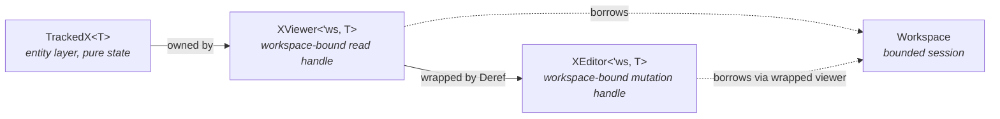
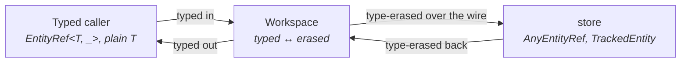

# Workspace

The `workspace` layer is the caller-facing surface of Pari. Every external consumer — tests, host applications, other libraries built on Pari — drives the system through workspace APIs. The layer also owns validation: rules, schemas, and the runner all live here because validation is invoked through workspace-bound handles.

A workspace is a **bounded session of entity work** over a store-side dispatcher. Anyone can construct one; multiple workspaces coexist over the same store. The same type is used in two roles:

- **Caller-side.** A client surface (CLI, MCP server, embedded Rust caller) constructs a workspace per scope of work and drops it when the scope ends.
- **Server-side.** The store layer constructs a per-request workspace over its own dispatch surface to invoke validation through the same handles callers use, so rules read sibling fields and resolve cross-entity refs uniformly.

The framework-level view is in [../framework.md](../framework.md). The layering rules are in [layer-model.md](layer-model.md). This document covers the L3 design: the bounded-session model, the three workspace-bound handles, the request shape, the access and mutation patterns, and how validation slots in.

## Shape Of The Layer

| Goal | Consequence for the design |
|---|---|
| Integrators construct the workspace explicitly | A workspace is constructed over an `Arc<dyn Dispatcher>` to the store layer; multiple workspaces over the same store coexist. |
| Callers work in typed terms; store is type-erased | Workspace is the only site that converts between `EntityRef<T, _>` / `TrackedX<T>` and the `AnyEntityRef` / `TrackedEntity` the store speaks. |
| One idiom for every operation | Each entry point is async, takes typed inputs, and returns `Result<_, ActivityError>`. |
| Mutation is gated by checkout at the type level | The handle that exposes setters and lifecycle is constructed only by `Workspace::checkout`. |
| Loads and mutations feel direct | Viewer accessors transparently trigger load; editor setters transparently call `ensure_mutable` and run validation. |
| Validation is invoked through the same handles callers use | Rules take `&XViewer<'_, T>`; sibling fields and cross-entity refs flow through workspace-bound accessors. |

## The Three Handles

Three workspace-bound types cover every interaction. The owning state — `TrackedX<T>` — is a pure entity-layer type with no async surface; workspace wraps it into bounded handles.

| Handle | Lifetime | What it holds | What it exposes |
|---|---|---|---|
| `Workspace` | Owned by the caller | An `Arc<dyn Dispatcher>` to the store and a `Validator` | Typed entry points: `resolve`, `has_ref`, `insert`, `checkout`, `remove`, `persist`, `revert_and_forget`, `forget`, `import` |
| `XViewer<'ws, T>` | Borrows the workspace | An owned `TrackedX<T>` and a `&'ws Workspace` | Per-field typed async read accessors; `validate()` / `validate_with(...)`; passes through to the workspace it borrows |
| `XEditor<'ws, T>` | Borrows the workspace through the wrapped viewer | An `XViewer<'ws, T>` (via `Deref`) | Everything `XViewer` exposes, plus per-field typed async setters and the consume-on-finish lifecycle: `commit(self)` / `undo_checkout(self)` |

The compile-time consequences:

- A read-only viewer cannot mutate or commit. The setters and lifecycle simply do not exist on it.
- Editors are returned only by `Workspace::checkout`; constructing one outside the workspace is not possible.
- Editors are not `Clone`. `commit(self)` and `undo_checkout(self)` consume the editor, so there is no stale handle to mutate after release.
- Viewers and editors borrow their workspace; they cannot outlive the session that issued them.

## Workspace Entry Points

Methods on `Workspace`. All are async and return `Result<_, ActivityError>` (except where noted). Every method takes typed refs and returns typed handles; the type-erasure that the store layer expects happens inside.

| Method | Returns | Purpose |
|---|---|---|
| `resolve(ref_)` | `XViewer<'_, T>` | Read-only handle to an entity in the store, fetching a stub from substrate on miss. |
| `has_ref(ref_)` | `bool` | Existence check; same machinery as `resolve` but without surfacing a not-found as an error. |
| `insert(plain)` | `()` | Add a new entity. The plain value is serialized to JSON at the workspace boundary; the store completes the JSON → tracked → validate pipeline before persisting in memory. |
| `checkout(ref_)` | `XEditor<'_, T>` | Acquire single-writer mutation rights to an entity. |
| `remove(ref_)` | `XViewer<'_, T>` | Evict an entity from the store; returns a viewer over the just-removed state. |
| `persist()` | `()` | Flush pending changes to the substrate. Fails if any entity is checked out. |
| `revert_and_forget(ref_)` | `()` | Roll an entity back to its last persisted state and drop it from the in-memory view. |
| `forget(ref_)` | `()` | Drop a clean entity's loaded fields, leaving a stub for re-fetch on next access. |
| `import(tracked)` | `XViewer<'_, T>` (sync) | Wrap a transient `TrackedX<T>` as a viewer for validation outside the store, e.g. validating a candidate before insert. |

`Workspace::new(dispatcher)` is the only constructor. It is cheap — one `Arc` clone plus a stamp of the static validation registry — so per-request construction inside store-side validation is a non-issue.

## Type ↔ Type-Erased Boundary

Workspace is the **sole** site that converts between typed and type-erased forms. The store and substrate layers never see typed entity values.

Inside a method body, the workspace converts `EntityRef<T, _>` to `AnyEntityRef`, dispatches a request that speaks `TrackedEntity`, and extracts the typed `TrackedX<T>` from the response before wrapping it as a viewer or editor.

## Access Pattern — Transparent Load

Viewer accessors hide load orchestration behind ordinary method calls. Conceptually, the generated body of an accessor for `field` on `XViewer<'_, T>`:

1. Check whether the field's `OnceLock` inside the owned `TrackedX<T>` is initialized.
2. If not, dispatch a load request through the workspace's dispatcher. The store runs its progressive-load loop, validates the fetched data, and initializes the `Arc<TrackedField<T>>` in place. The viewer's clone of that `Arc` observes the write immediately.
3. Return the loaded value (with small ergonomic projections such as `String` → `&str`, `Vec<T>` → `&[T]`).

The same pathway fires when validation needs to verify a cross-entity ref: a rule calls `viewer.workspace().resolve(other_ref).await`, which — if the entity is not yet in the store — triggers the same store-side load and stub-insert machinery. Transparent expansion is a property of the access pattern, not of caller-facing reads specifically.

Load orchestration itself — round structure, prerequisite resolution, ref prefetch — is owned by the `store` layer and described there.

## Mutation Pattern — Candidate, Validate, Swap

Setters on `XEditor<'_, T>` run four steps synchronously within the caller's task:

1. **Prepare the field for overwrite.** Dispatch `EnsureMutable` for the target field. The store loads any prerequisites and, if the substrate requires it, the field itself — preventing a later load from silently clobbering the new value.
2. **Build a candidate.** Clone the editor's wrapped viewer's owned `TrackedX<T>` and replace the target field with a fresh `Arc::new(TrackedField::mutated(value))`. Untouched fields keep their existing `Arc`, so validation sees a consistent snapshot of the rest of the entity.
3. **Validate the candidate in-process.** Wrap the candidate in a transient `XViewer<'_, T>` over the same workspace and run `Structural` + `Semantic` rules through the workspace's `Validator`, scoped to the mutated field. A failure returns `ActivityError` without mutating the editor.
4. **Swap the `Arc`.** On success, `Arc::clone` the candidate's field into the editor's owned tracked state, leaving all other fields untouched.

`Cross-entity` validation runs at commit, not at the setter — those rules need the full resolved graph and have to be reasoned about against in-store entities.

## Validation

Validation is a sub-area of `workspace`. The full three-kind model (structural, semantic, cross-entity), the per-entity schema, and the rule authoring conventions are documented in [validation.md](validation.md). The workspace-level shape:

- A `Validator` holds a `&'static` reference to a process-wide rule registry. `Validator::new()` is effectively free — it stamps the static reference. Each `Workspace` constructs its own validator on creation.
- Rules take `&XViewer<'_, T>`. Reading the entity's own fields and resolving cross-entity refs both go through the same workspace-bound accessors that callers use.
- The workspace decides which `ValidationKind`s run at each invocation site. The store layer triggers validation through workspace handles but does not pick the kinds.

| Site | Where validation runs | Which kinds |
|---|---|---|
| Setter (per-field) | `XEditor::set_<field>`, against a transient candidate viewer | `Structural`, `Semantic` |
| Insert | Server-side, via a per-request workspace constructed by store | `Structural`, `Semantic`, `CrossEntity` |
| Commit | Server-side, via a per-request workspace constructed by store | `CrossEntity` (whole entity if newly added; dirty fields otherwise) |
| Load | Server-side, via a per-request workspace constructed by store, against the loaded snapshot before merge | `Structural`, `Semantic` |
| Persist | — | None — persist trusts that prior commits were already gated. |

`Workspace::import(tracked).validate().await` is the path for validating transient entities not yet in the store; it's how the server-side workspace runs cross-entity rules during insert and commit.

## Pure And Orchestration Components

Per [layer-model.md](layer-model.md#within-layer-structure), workspace splits along the same boundary as every other layer.

| Role | What lives there | Error type |
|---|---|---|
| Pure (`lib/`) | Validation rule definitions, schemas, the runner, rule-set registry | `PrimitiveError` at every boundary |
| Orchestration (layer root) | `Workspace`, `XViewer`, `XEditor`, `Validator`, generated typed accessors and setters | `ActivityError` — wraps validation `PrimitiveError`s; forwards store-originated `ActivityError` unchanged |

Channel failures between the workspace's dispatcher and the store layer are classified inside the store and arrive as activity errors; orchestration sites forward them.

## Boundaries

| Concern | Owner |
|---|---|
| Caller-facing async API, viewer/editor handles, accessor/setter generation, validation rules and runner | `workspace` |
| In-memory state, dispatch flow, load/persist orchestration, JSON ↔ tracked pipeline | `store` |
| Asset layout, file formats, backend implementations | `substrate` |
| Tracked entity state types, refs, plain entities | `entity` |
| Cross-layer error classification and aggregation | `error` |

Workspace code that starts describing store state, asset pipelines, or how the store decides which kinds run has crossed out of this layer.
