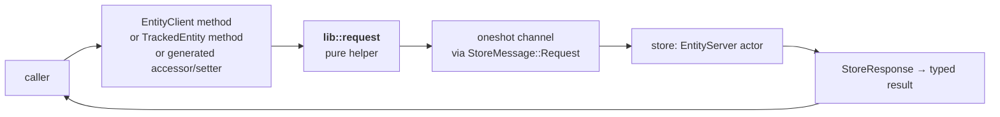

# Workspace

The `workspace` layer is the caller-facing surface of Pari. Every external
consumer — tests, host applications, other libraries built on Pari — drives
the system through workspace APIs. The layer hands each request off to the
`store` layer's actor and returns the typed result; it owns no entity state
itself.

The framework-level view is in [../framework.md](../framework.md). The
layering rules are in [layer-model.md](layer-model.md). This document covers
the L3 design: entry points, the uniform request shape, the access and
mutation patterns on tracked entities, and the pure/orchestration split.

## Shape Of The Layer

| Goal | Consequence for the design |
|---|---|
| Callers never touch actor plumbing | A single `lib::request` helper constructs messages, sends them, and awaits replies. |
| One idiom for every operation | Each entry point is async, takes typed inputs, and returns `Result<_, ActivityError>`. |
| Loads and mutations feel direct | Accessors transparently trigger `load`; setters transparently call `ensure_mutable`. |
| Writes are rejected at the call site, not discovered later | Setters run structural and semantic validation synchronously before swapping the field. |

`workspace` depends on `store` (for the request/response protocol),
`validation` (for the setter-time rule runner), `entity` (for refs and
tracked entities), and `error` (for `ActivityError`). It does not depend on
`substrate`.

## Entry Points

Three surfaces cover every caller interaction. All are async and surface
`ActivityError`.

| Surface | Location | Used for |
|---|---|---|
| `EntityClient::*` | [src/workspace/client.rs](../../../src/workspace/client.rs) | Operations keyed by `AnyEntityRef`: `resolve`, `has_ref`, `insert`, `remove`, `checkout`, `load`, `ensure_mutable`, `persist`, `undo_commit`, `unload`. |
| `TrackedEntity::{commit, undo_checkout}` | [src/workspace/tracked_entity.rs](../../../src/workspace/tracked_entity.rs) | Methods on a checked-out entity — consume or release it back to the store. |
| Generated accessors / setters | `#[derive(Entity)]` output — see `generate_accessors_and_setters` in [pari-macros/src/workspace_codegen.rs](../../../pari-macros/src/workspace_codegen.rs) | Per-field `fn name(&self) -> Result<&T, …>` and `fn set_name(&mut self, value: T) -> Result<(), …>` on every plain entity. |

`EntityClient` itself is a zero-sized type — there is no client state. The
handle is the `AnyEntityRef` passed to each call.

## Uniform Request Shape

Every entry point follows the same five-step path:

The `request` helper in [src/workspace/lib/request.rs](../../../src/workspace/lib/request.rs)
builds the `StoreMessage::Request`, sends it on the store's sender, and
awaits the oneshot reply. The orchestration sites above it unwrap the
`StoreResponse` variant they expect and forward any `StoreResponse::Err`
back to the caller.

## Access Pattern — Transparent Load

Field accessors hide load orchestration behind ordinary method calls. The
generated body lives in `generate_accessors_and_setters`
([pari-macros/src/workspace_codegen.rs](../../../pari-macros/src/workspace_codegen.rs)).
Conceptually:

1. Check whether the field's `OnceLock` is initialized.
2. If not, issue `EntityClient::load(any_ref, field)`. The store runs its
   progressive-load loop, validates the fetched data, and initializes the
   `Arc<TrackedField<T>>` in place. The caller's clone of that `Arc`
   observes the write immediately.
3. Return the loaded value (with small ergonomic projections such as
   `String` → `&str`, `Vec<T>` → `&[T]`).

The same pathway fires when validation needs to verify that a cross-entity
ref exists: a rule calls `EntityClient::resolve` or `EntityClient::has_ref`,
which — if the entity is not yet in the store — triggers the same
store-side load and stub-insert machinery. Transparent expansion is a
property of the access pattern, not of user-facing reads specifically.

Load orchestration itself — round structure, prerequisite resolution, ref
prefetch — is owned by the `store` layer and described there.

## Mutation Pattern — `ensure_mutable` Then Inline Validation

Setters run four steps, synchronously within the caller's task. The
generated body lives alongside the accessor in
`generate_accessors_and_setters`
([pari-macros/src/workspace_codegen.rs](../../../pari-macros/src/workspace_codegen.rs)).

1. **Prepare the field for overwrite.** Call
   `EntityClient::ensure_mutable(any_ref, field)`. The store loads any
   prerequisites and, if the substrate requires it, the field itself —
   preventing a later load from silently clobbering the new value.
2. **Build a candidate.** Clone `self` and replace the target field with a
   fresh `Arc::new(TrackedField::mutated(value))`. Untouched fields keep
   their existing `Arc` — tracking is per-field, so validation sees a
   consistent snapshot of the rest of the entity.
3. **Validate the candidate in-process.** Run
   `validation::run_validations` with `ValidationKind::Structural` and
   `ValidationKind::Semantic`, scoped to the mutated field. This is
   workspace-owned validation: it happens at the call site, not at commit
   or persist time. A failure returns `ActivityError` without mutating
   `self`.
4. **Swap the `Arc`.** On success, `Arc::clone` the candidate's field into
   `self`, leaving all other fields untouched.

Cross-entity validation runs at store-managed boundaries (commit, persist)
rather than inside setters — those kinds need the full resolved graph and
the store's cross-entity context to run meaningfully. Setter-time
validation is deliberately scoped to rules that can be decided from the
candidate entity alone.

## Pure And Orchestration Components

Per [layer-model.md](layer-model.md#within-layer-structure), workspace
splits along the same boundary as every other layer:

| Role | File(s) | Error type |
|---|---|---|
| Pure | [lib/request.rs](../../../src/workspace/lib/request.rs) | `PrimitiveError` on channel failure |
| Orchestration | [client.rs](../../../src/workspace/client.rs), [tracked_entity.rs](../../../src/workspace/tracked_entity.rs) | Wraps primitive channel failures and forwards store-originated `ActivityError` |

The pure helper owns the mechanical send/await. Orchestration sites
translate primitive channel failures into `ActivityError::store_unavailable`
with an `entity_server` hint, and surface application-level errors carried
inside `StoreResponse::Err` unchanged.

## Boundaries

| Concern | Owner |
|---|---|
| Caller-facing async API, accessor/setter generation | `workspace` |
| Actor state, message protocol, load/persist orchestration | `store` |
| Asset layout, file formats, backend implementations | `substrate` |
| Rule definition and execution | `validation` |
| Cross-layer error classification and aggregation | `error` |

Workspace code that starts describing actor state, asset pipelines, or
rule authoring has crossed out of this layer.
